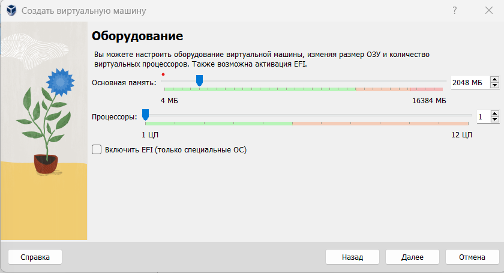
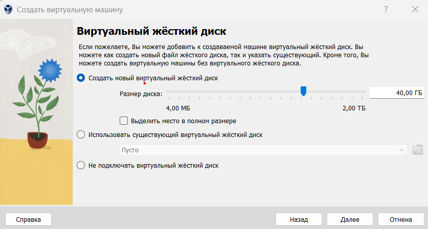
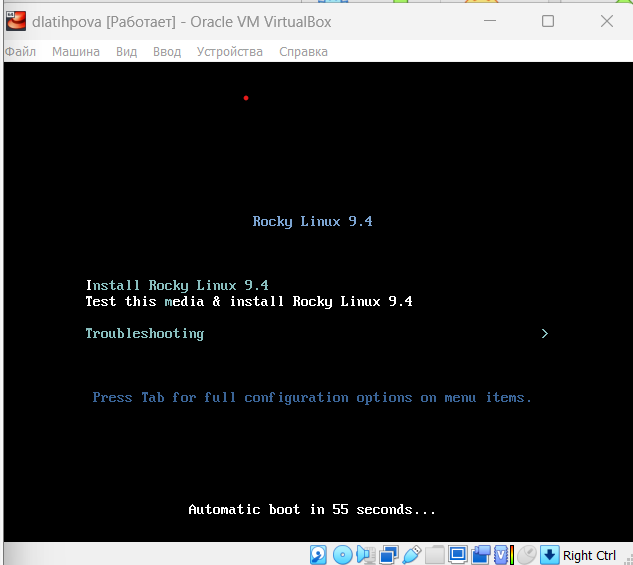
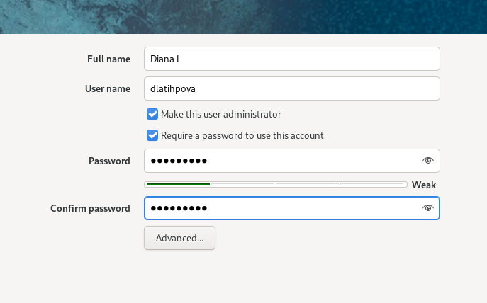
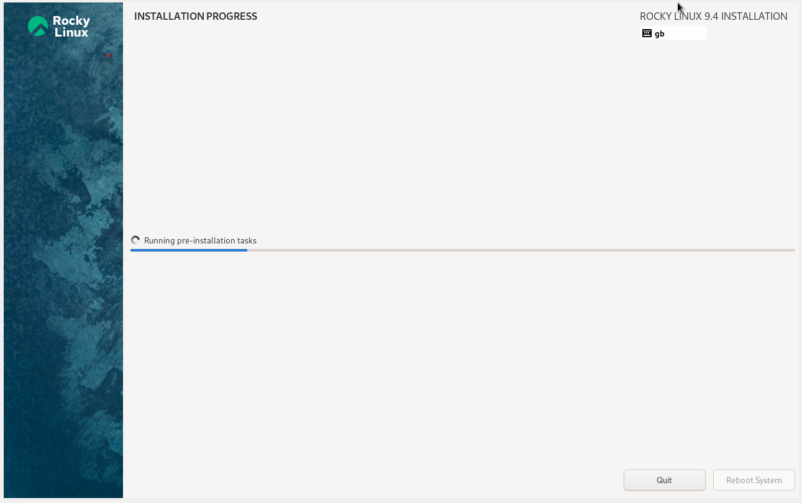
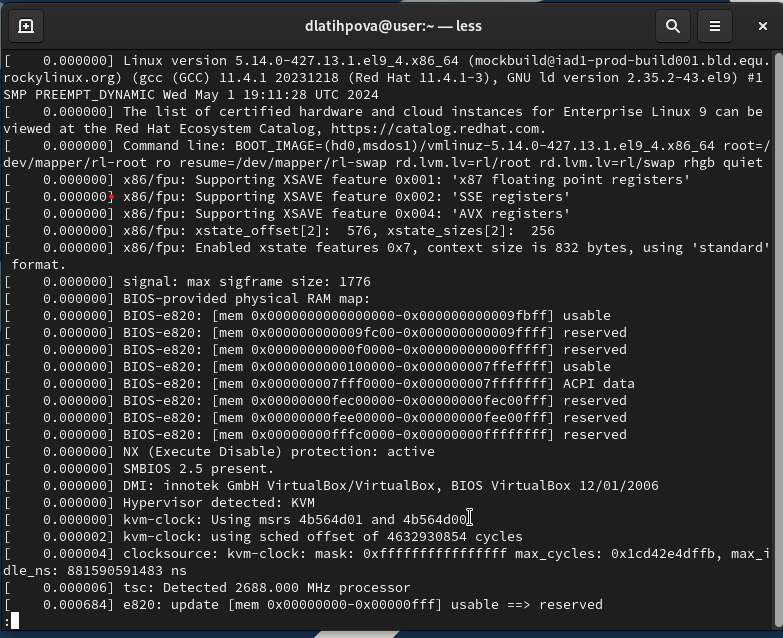
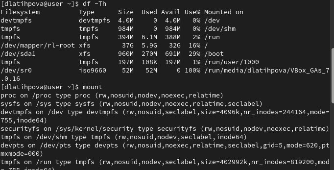

---
## Front matter
title: "Лабораторная работа №1"
subtitle: "Установка и конфигурация операционной системы на виртуальную машину"
author: "Латыпова Диана. НФИбд-02-21"

## Generic otions
lang: ru-RU
toc-title: "Содержание"

## Bibliography
bibliography: bib/cite.bib
csl: pandoc/csl/gost-r-7-0-5-2008-numeric.csl

## Pdf output format
toc: true # Table of contents
toc-depth: 2
lof: true # List of figures
lot: true # List of tables
fontsize: 12pt
linestretch: 1.5
papersize: a4
documentclass: scrreprt
## I18n polyglossia
polyglossia-lang:
  name: russian
  options:
	- spelling=modern
	- babelshorthands=true
polyglossia-otherlangs:
  name: english
## I18n babel
babel-lang: russian
babel-otherlangs: english
## Fonts
mainfont: IBM Plex Serif
romanfont: IBM Plex Serif
sansfont: IBM Plex Sans
monofont: IBM Plex Mono
mathfont: STIX Two Math
mainfontoptions: Ligatures=Common,Ligatures=TeX,Scale=0.94
romanfontoptions: Ligatures=Common,Ligatures=TeX,Scale=0.94
sansfontoptions: Ligatures=Common,Ligatures=TeX,Scale=MatchLowercase,Scale=0.94
monofontoptions: Scale=MatchLowercase,Scale=0.94,FakeStretch=0.9
mathfontoptions:
## Biblatex
biblatex: true
biblio-style: "gost-numeric"
biblatexoptions:
  - parentracker=true
  - backend=biber
  - hyperref=auto
  - language=auto
  - autolang=other*
  - citestyle=gost-numeric
## Pandoc-crossref LaTeX customization
figureTitle: "Рис."
tableTitle: "Таблица"
listingTitle: "Листинг"
lofTitle: "Список иллюстраций"
lotTitle: "Список таблиц"
lolTitle: "Листинги"
## Misc options
indent: true
header-includes:
  - \usepackage{indentfirst}
  - \usepackage{float} # keep figures where there are in the text
  - \floatplacement{figure}{H} # keep figures where there are in the text
---

# Цель работы

Приобретение практических навыков установки операционной системы на виртуальную машину, настройки минимально необходимых для дальнейшей работы сервисов.

# Задание

Установить операционную систему на виртуальную машину.

# Теоретическое введение

**VirtualBox** [@virtualbox:bash] - это бесплатная и открытая система виртуализации, которая позволяет запускать несколько операционных систем на одном компьютере. Она поддерживает множество ОС, включая Linux, Windows и macOS. С помощью VirtualBox можно создавать и управлять виртуальными машинами, что удобно для тестирования, разработки и изоляции приложений.

**CentOS**  (Community ENTerprise Operating System) [@centos:bash] - это дистрибутив Linux, который ранее был бинарной копией Red Hat Enterprise Linux (RHEL), созданный сообществом. 

CentOS предоставлял бесплатный вариант RHEL с теми же пакетами и функциональностью, но без официальной поддержки и с менее частыми обновлениями. В конце 2020 года Red Hat объявила о смене фокуса CentOS на CentOS Stream, который представляет собой "поток" обновлений, предшествующий RHEL. Это изменение вызвало создание альтернативных дистрибутивов, таких как Rocky Linux и AlmaLinux.

**Rocky** [@rocky:bash] - это свободный и открытый дистрибутив Linux, созданный как преемник CentOS после изменений в его стратегическом направлении. Разработан и поддерживается сообществом, Rocky Linux стремится быть совместимым с RHEL (Red Hat Enterprise Linux), предоставляя стабильную и надежную операционную систему для серверов и рабочих станций.

# Выполнение лабораторной работы

Для начала с создания виртуальной машины. Задала имя и ОС машины (рис. [-@fig:001]):

{#fig:001 width=70%}

Далее задала оборудование ВМ. Задала размер основной памяти 2048МБ (рис. [-@fig:002]):

{#fig:002 width=70%}

Задала размер диска равным 40ГБ (рис. [-@fig:003]):

{#fig:003 width=70%}

Запустила ВМ (рис. [-@fig:004]):

{#fig:004 width=70%}

После чегоо приступила к настройке установки ОС:

- Выбрала программу (рис. [-@fig:005]):

{#fig:005 width=70%}


- Установила пароль для root (рис. [-@fig:006]):

{#fig:006 width=70%}


- Установила пароль для пользователя с правами администратора (рис. [-@fig:007]):

{#fig:007 width=70%}

- Место установки (рис. [-@fig:008]):

{#fig:008 width=70%}

- Отключила KDUMP (рис. [-@fig:009]):

{#fig:009 width=70%}

- Сеть и имя узла (рис. [-@fig:010]):

{#fig:010 width=70%}

Запустила установку ОС (рис. [-@fig:011]):

{#fig:011 width=70%}

Подключила и запустила образ диска дополнений гостевой ОС (рис. [-@fig:012]) (рис. [-@fig:013]):

{#fig:012 width=70%}

{#fig:013 width=70%}

Приступила к выполнению заданий:

- Проанализировала последовательность загрузки системы, выполнив (рис. [-@fig:014]):

```
dmesg | less
```

{#fig:0014 width=70%}

- Вывела версию ядра Linux, выполнив (рис. [-@fig:015]):

```
dmesg  | grep -i "linux version"
```

- Вывела частоту процессора, выполнив (рис. [-@fig:015]):

```
dmesg  | grep -i "Mhz"
```

- Вывела модель процессора, выполнив (рис. [-@fig:015]):

```
dmesg  | grep -i "CPU0"
```

- Вывела объем доступной оперативной памяти, выполнив (рис. [-@fig:015]):

```
dmesg  | grep -i "memory"
```

{#fig:015 width=70%}

- Вывела тип обнаруженного гипервизора, выполнив (рис. [-@fig:016]):

```
dmesg  | grep -i "hypervisor"
```
{#fig:016 width=70%}

- Вывела тип файловой системы корневого раздела (рис. [-@fig:017]):

```
df -Th
```
{#fig:017 width=70%}

- Вывела тип обнаруженного гипервизора, выполнив (рис. [-@fig:018]):

```
mount
```
или
```
dmesg  | grep -i "Mount"
```

{#fig:018 width=70%}

# Контрольные вопросы

1. Какую информацию содержит учётная запись пользователя?

Учётная запись пользователя **содержит**:
Системное имя (user name), ID, GID (Group Identifier), Полное имя (full name)
Домашний каталог (home directory), начальная оболочка(shell), пароль (password)- эта информация хранится в файле /etc/passwd для общих данных и в /etc/shadow для хранения паролей.

2. Команды терминала и примеры:

- Для получения справки по команде используется команда man:
```
man ls   # Просмотр справки по команде ls
```
- Для перемещения по файловой системе используется команда cd:
```
cd /home/user   # Переход в каталог /home/user
cd ~            # Переход в домашний каталог
```
- Для просмотра содержимого каталога используется команда ls:
```
ls /home/user    # Просмотр содержимого каталога /home/user
ls -l            # Подробный список с правами доступа
```
- Для определения объёма каталога используется команда du:
```
du -sh /home/user   # Определение объёма каталога в человекочитаемом формате
```
- Для создания/удаления каталогов и файлов bспользуются команды mkdir, rmdir, touch и rm:
```
mkdir /home/user/catalog   # Создание нового каталога
rmdir /home/user/catalog   # Удаление пустого каталога
touch file.txt         	   # Создание пустого файла
rm file.txt                # Удаление файла
```
- Для задания определённых прав на файл/каталог используется команда chmod для изменения прав доступа:
```
chmod u+x  # Назначить права на выполнение для пользователя (владельца) файла
```
- Для просмотра истории команд используется команда history.

3. Что такое файловая система? Приведите примеры с краткой характеристикой.

**Файловая система** — это способ организации данных на носителях информации. Она управляет хранением, доступом и структурированием файлов на устройстве.

Примеры файловых систем:
- ext4 (Extended Filesystem 4): современная файловая система, широко используемая в Linux, поддерживает большие файлы и жесткие диски, улучшенная производительность.
- XFS: высокопроизводительная файловая система, хорошо работает с большими объёмами данных.
- Btrfs (B-tree filesystem): новая файловая система с поддержкой снимков и самовосстановления.
- FAT32: устаревшая файловая система, поддерживаемая практически всеми операционными системами, но ограниченная размером файлов до 4 ГБ.

4. Как посмотреть, какие файловые системы подмонтированы в ОС?

Для просмотра смонтированных файловых систем используется **команда df** или **mount**.

5. Как удалить зависший процесс?

Для завершения зависшего процесса используется **команда kill**. Сначала необходимо узнать PID процесса, который можно получить с помощью команды ps или top.


# Выводы

Я приобрела практические навыки установки операционной системы на виртуальную машину, настройки минимально необходимых для дальнейшей работы сервисов. А также вспомнила, как применять средства контроля версий, как работать с git, как работать с Markdown.
 
# Список литературы{.unnumbered}

::: {#refs}
:::
