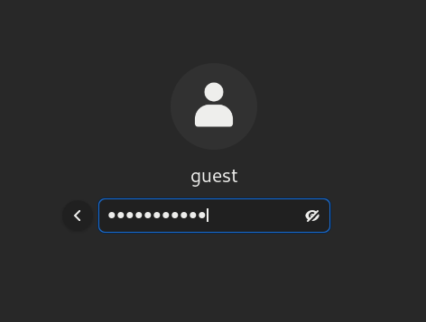
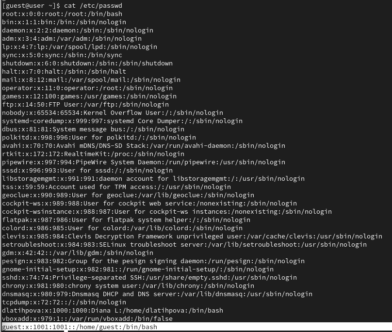
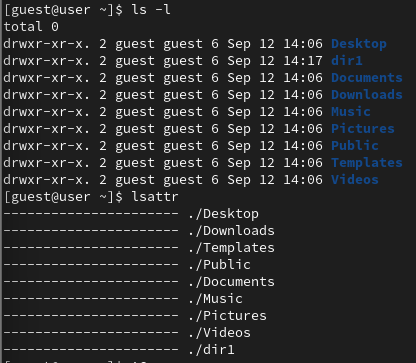
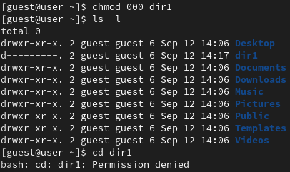
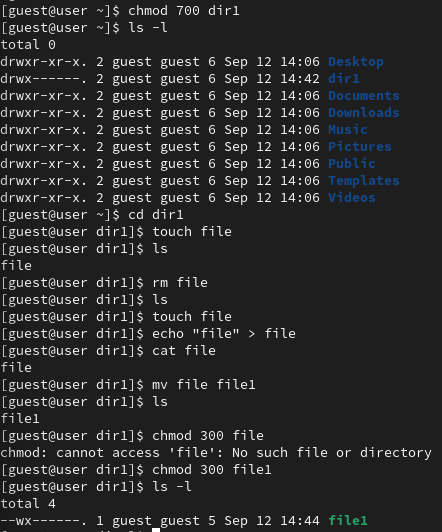
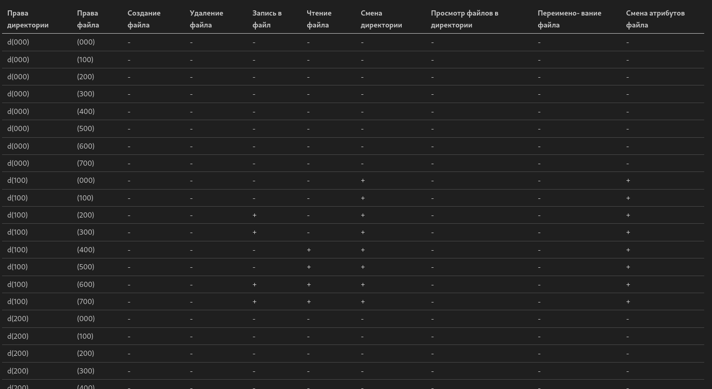
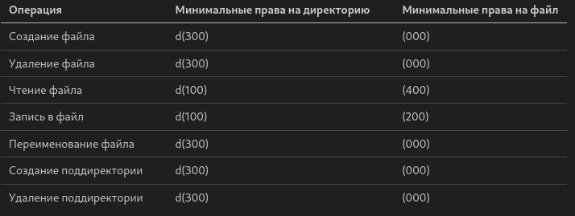

---
## Front matter
lang: ru-RU
title: Лабораторная работа №2
subtitle: Дискреционное разграничение прав в Linux. Основные атрибуты
author:
  - Латыпова Диана.
institute:
  - Российский университет дружбы народов имени Патриса Лумумбы, Москва, Россия
date: 12 сентября 2024

## i18n babel
babel-lang: russian
babel-otherlangs: english

## Formatting pdf
toc: false
toc-title: Содержание
slide_level: 2
aspectratio: 169
section-titles: true
theme: metropolis
header-includes:
 - \metroset{progressbar=frametitle,sectionpage=progressbar,numbering=fraction}
---

# Информация

## Докладчик

:::::::::::::: {.columns align=center}
::: {.column width="70%"}

  * Латыпова Диана
  * студент группы НФИбд-02-21
  * Российский университет дружбы народов имени Патриса Лумумбы
  * [1032215005@rudn.ru](mailto:1032215005@rudn.ru)
  * <https://github.com/dlatypova>

:::
::: {.column width="30%"}

:::
::::::::::::::

# Вводная часть

## Цели и задачи

Получение практических навыков работы в консоли с атрибутами файлов, закрепление теоретических основ дискреционного разграничения доступа в современных системах с открытым кодом на базе ОС Linux.

# Теоретическая часть

## Управление пользователями

При создании новой учётной записи, система присваивает пользователю:

- *UID (User ID)* — уникальный идентификатор пользователя;
- *GID (Group ID)* — уникальный идентификатор основной группы пользователя.

Права доступа:

- *Чтение (r)* — разрешает чтение содержимого файла директории;
- *Запись (w)* — разрешает изменение файлав директории;
- *Выполнение (x)* — разрешает выполнение файла директории.

Дополнительные ограничения атрибутов:

- *i (immutable)* — запрещает изменение файла или директории;
- *a (append-only)* — разрешает только добавление данных в файл.

# Выполнение лабораторной работы

## Учетная запись

`useradd guest`- создание учётной записи пользователя guest 

`passwd guest`- задание пароля

{#fig:001 width=50%}

## Команды, чтобы узнать информацию об учетной записи

- *whoami* — отображает имя текущего пользователя;
- *id* — выводит информацию о пользователе: UID, GID и группы;
- *groups* — показывает, в какие группы входит пользователь;
- *cat* - просмотр файла.

{#fig:002 width=40%}

## Просмотр прав и атрибутов

- `ls -l /home/`- вывод списка пользователей и их домашних директорий;
- `lsattr`- вывод атрибутов, выставленных на директорию;
- `chmod` - изменение прав пользователя.

{#fig:003 width=50%}

## Манипуляции с файлом в директории dir1 при разных правах

- `chmod 000`:

{#fig:004 width=40%}

- `chmod 700`:

{#fig:005 width=40%}

# Полученные таблицы

## Установленные права и разрешённые действия

{#fig:006 width=40%}

## Минимальные права для совершения операций

{#fig:007 width=50%}

# Выводы

## Вывод

- Получены практические навыки работы в консоли с атрибутами файлов;
- Закреплены теоретические основы дискреционного разграничения доступа в современных системах с открытым кодом на базе ОС Linux.