---
## Front matter
title: "Лабораторная работа №2"
subtitle: "Дискреционное разграничение прав в Linux. Основные атрибуты"
author: "Латыпова Диана. НФИбд-02-21"

## Generic otions
lang: ru-RU
toc-title: "Содержание"

## Bibliography
bibliography: bib/cite.bib
csl: pandoc/csl/gost-r-7-0-5-2008-numeric.csl

## Pdf output format
toc: true # Table of contents
toc-depth: 2
lof: true # List of figures
lot: true # List of tables
fontsize: 12pt
linestretch: 1.5
papersize: a4
documentclass: scrreprt
## I18n polyglossia
polyglossia-lang:
  name: russian
  options:
	- spelling=modern
	- babelshorthands=true
polyglossia-otherlangs:
  name: english
## I18n babel
babel-lang: russian
babel-otherlangs: english
## Fonts
mainfont: IBM Plex Serif
romanfont: IBM Plex Serif
sansfont: IBM Plex Sans
monofont: IBM Plex Mono
mathfont: STIX Two Math
mainfontoptions: Ligatures=Common,Ligatures=TeX,Scale=0.94
romanfontoptions: Ligatures=Common,Ligatures=TeX,Scale=0.94
sansfontoptions: Ligatures=Common,Ligatures=TeX,Scale=MatchLowercase,Scale=0.94
monofontoptions: Scale=MatchLowercase,Scale=0.94,FakeStretch=0.9
mathfontoptions:
## Biblatex
biblatex: true
biblio-style: "gost-numeric"
biblatexoptions:
  - parentracker=true
  - backend=biber
  - hyperref=auto
  - language=auto
  - autolang=other*
  - citestyle=gost-numeric
## Pandoc-crossref LaTeX customization
figureTitle: "Рис."
tableTitle: "Таблица"
listingTitle: "Листинг"
lofTitle: "Список иллюстраций"
lotTitle: "Список таблиц"
lolTitle: "Листинги"
## Misc options
indent: true
header-includes:
  - \usepackage{indentfirst}
  - \usepackage{float} # keep figures where there are in the text
  - \floatplacement{figure}{H} # keep figures where there are in the text
---

# Цель работы

Получение практических навыков работы в консоли с атрибутами файлов, закрепление теоретических основ дискреционного разграничения доступа в современных системах с открытым кодом на базе ОС Linux.

# Задание

Постарайтесь последовательно выполнить все пункты, занося ваши ответы на поставленные вопросы и замечания в отчёт.
1. В установленной при выполнении предыдущей лабораторной работы
операционной системе создайте учётную запись пользователя guest (использую учётную запись администратора):
`useradd guest`
2. Задайте пароль для пользователя guest (использую учётную запись администратора):
`passwd guest`
3. Войдите в систему от имени пользователя guest.
4. Определите директорию, в которой вы находитесь, командой `pwd`. Сравните её с приглашением командной строки. Определите, является ли она вашей домашней директорией? Если нет, зайдите в домашнюю директорию.
5. Уточните имя вашего пользователя командой `whoami`.
6. Уточните имя вашего пользователя, его группу, а также группы, куда входит пользователь, командой `id`. Выведенные значения uid, gid и др. запомните. Сравните вывод id с выводом команды `groups`.
7. Сравните полученную информацию об имени пользователя с данными,
выводимыми в приглашении командной строки.
8. Просмотрите файл /etc/passwd командой
`cat /etc/passwd`
Найдите в нём свою учётную запись. Определите uid пользователя.
Определите gid пользователя. Сравните найденные значения с полученными в предыдущих пунктах.
9. Определите существующие в системе директории командой
`ls -l /home/`
Удалось ли вам получить список поддиректорий директории /home? Какие права установлены на директориях?
10. Проверьте, какие расширенные атрибуты установлены на поддиректориях, находящихся в директории /home, командой:
`lsattr /home`
Удалось ли вам увидеть расширенные атрибуты директории?
Удалось ли вам увидеть расширенные атрибуты директорий других
пользователей?
11. Создайте в домашней директории поддиректорию dir1 командой
`mkdir dir1`
Определите командами `ls -l` и `lsattr`, какие права доступа и расширенные атрибуты были выставлены на директорию dir1.
12. Снимите с директории dir1 все атрибуты командой
`chmod 000 dir1`
и проверьте с её помощью правильность выполнения команды
`ls -l`
13. Попытайтесь создать в директории dir1 файл file1 командой
`echo "test" > /home/guest/dir1/file1`
Объясните, почему вы получили отказ в выполнении операции по созданию файла?
Оцените, как сообщение об ошибке отразилось на создании файла? Проверьте командой
`ls -l /home/guest/dir1`
действительно ли файл file1 не находится внутри директории dir1.
14. Заполните таблицу «Установленные права и разрешённые действия»
(см. табл. 2.1), выполняя действия от имени владельца директории (файлов), определив опытным путём, какие операции разрешены, а какие нет.
Если операция разрешена, занесите в таблицу знак «+», если не разрешена, знак «-»
15. На основании заполненной таблицы определите те или иные минимально необходимые права для выполнения операций внутри директории
dir1, заполните табл. 2.2.

# Теоретическое введение

1. Управление пользователями [@users:bash]

В Linux каждая задача и процесс привязаны к конкретному пользователю, имеющему определённые права и доступ к ресурсам. При создании новой учётной записи, система присваивает пользователю:
- *UID (User ID)* — уникальный идентификатор пользователя;
- *GID (Group ID)* — уникальный идентификатор основной группы пользователя.

Пользователь может состоять в нескольких группах. Каждая группа может предоставлять различные уровни доступа к системным ресурсам.

2. Права доступа к файлам и директориям [@roots:bash]

Каждый файл и директория в Linux имеют три уровня доступа:

- *Владелец (owner)* — пользователь, создавший файл;
- *Группа (group)* — группа, которой принадлежит файл;
- *Остальные пользователи (others)* — все остальные пользователи системы.

Права доступа могут быть назначены для каждого уровня и разделяются на три типа:

- *Чтение (r)* — разрешает чтение содержимого файла или просмотр содержимого директории;
- *Запись (w)* — разрешает изменение файла или создание/удаление файлов в директории;
- *Выполнение (x)* — разрешает выполнение файла или доступ к содержимому директории.

3. Команды для работы с пользователями и файлами [@roots:bash]

- *useradd* — добавляет нового пользователя в систему;
- *passwd* — изменяет или устанавливает пароль пользователя;
- *whoami* — отображает имя текущего пользователя;
- *id* — выводит информацию о пользователе: UID, GID и группы;
- *groups* — показывает, в какие группы входит пользователь.

4. Атрибуты файлов и директорий [@attributes:bash]

Кроме стандартных прав доступа, файлы и директории могут иметь расширенные атрибуты, управляемые с помощью команды lsattr. Эти атрибуты добавляют дополнительные ограничения, например:

- *i (immutable)* — запрещает изменение файла или директории;
- *a (append-only)* — разрешает только добавление данных в файл.

# Выполнение лабораторной работы

С помощью команды `useradd guest`  создала учётную запись пользователя guest (рис. [-@fig:001]):

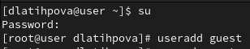{#fig:001 width=70%}

Затем задала пароль пользователя с помощью `passwd guest` (рис. [-@fig:002]):

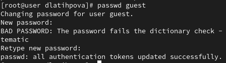{#fig:002 width=70%}

Вошла в систему от имени пользователя guest (рис. [-@fig:003]):

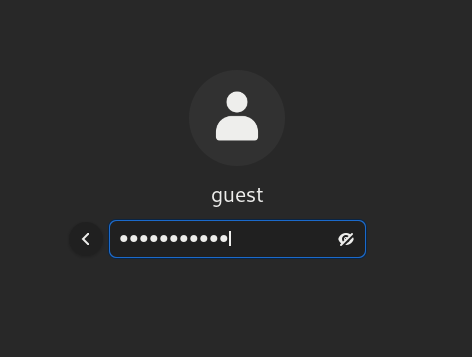{#fig:003 width=70%}

С помощью команды `pwd` определила директорию, в которой нахожусь. Эта директория является домашней директорией (рис. [-@fig:004]):

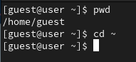{#fig:004 width=70%}

С помощью команды `whoami` уточнила имя пользователя (рис. [-@fig:005]):

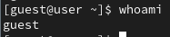{#fig:005 width=70%}

С помощью команды `uid` уточнила имя моего пользователя, его группу, а также группы, куда входит пользователь и сравнила id с выводом команды `groups`. Команда id выводит больше информации, чем groups, включая UID и GID (рис. [-@fig:006]):

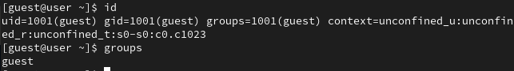{#fig:006 width=70%}

Далее просмотрела файл /etc/passwd командой `cat /etc/passwd`. Нашла в нём свою учётную запись. Uid [1001] и Gid [1001] совпадают с значениями в предыдущем шаге (рис. [-@fig:007]):

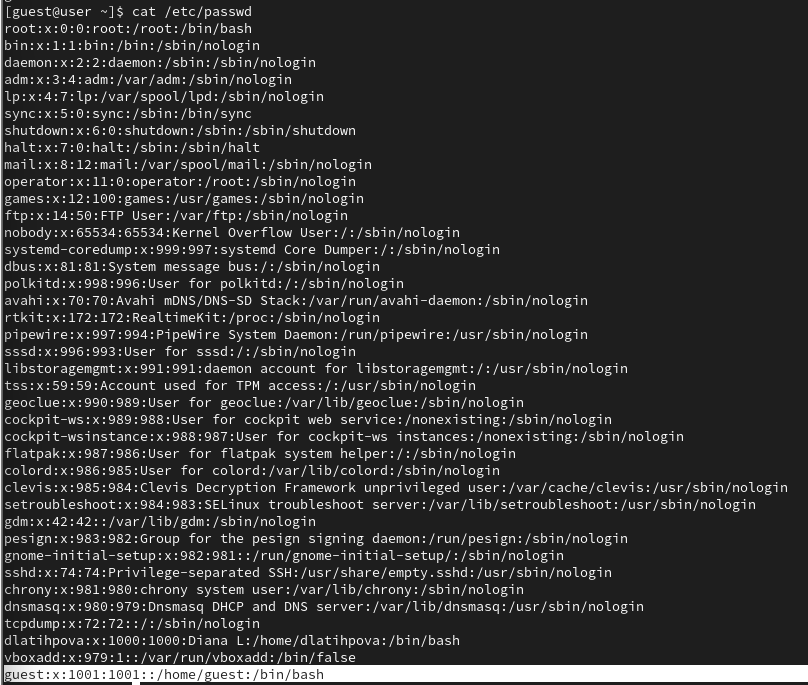{#fig:007 width=70%}

С помощью команды `ls -l /home/` вывела список пользователей и их домашние директории. Видим, что dlatihpova и guest могут читать, писать и выполнять , группа имеет доступ только на чтение, остальные пользователи не имеют никаких прав доступа к директориям (рис. [-@fig:008]):

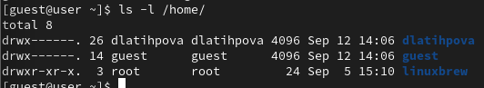{#fig:008 width=70%}

С помощью команды `lsattr /home` определила, что никакие расширенные атрибуты для директорий не установлены (рис. [-@fig:009]):

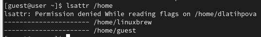{#fig:009 width=70%}

Далее создала поддиректорию dir1 с помощью команды `mkdir dir1` (рис. [-@fig:010]):

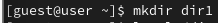{#fig:010 width=70%}

С помощью команд `ls -l` и `lsattr` видим, какие права доступа (drwxr-xr-x) и расширенные атрибуты выставлены на директорию dir1 (рис. [-@fig:011]):

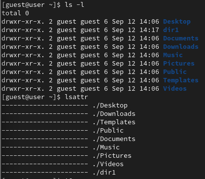{#fig:011 width=70%}

Затем сняла с директории dir1 все атрибуты `chmod 000 dir1` (рис. [-@fig:012]):

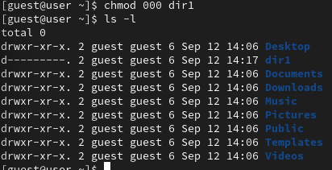{#fig:012 width=70%}

Попыталась создать в директории dir1 файл file1 командой `echo "test" > /home/guest/dir1/file1`, но не получилось, так как права на директорию были сняты. Файл тоже не получится создать, так как у нас нет прав на запись в эту директорию(рис. [-@fig:013]):

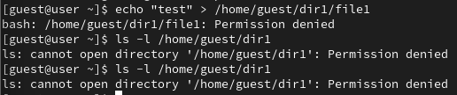{#fig:013 width=70%}

Наконец, заполним таблицу 2.1:

|Права директории|Права  файла|Создание  файла|Удаление  файла|Запись  в файл|Чтение  файла|Смена  директории|Просмотр файлов в  директории|Переимено- вание файла|Смена  атрибутов  файла|
|-|-|-|-|-|-|-|-|-|-|
|d(000)|(000)| -| -| -| -| -| -| -| -|
|d(000)|(100)| -| -| -| -| -| -| -| -|
|d(000)|(200)| -| -| -| -| -| -| -| -|
|d(000)|(300)| -| -| -| -| -| -| -| -|
|d(000)|(400)| -| -| -| -| -| -| -| -|
|d(000)|(500)| -| -| -| -| -| -| -| -|
|d(000)|(600)| -| -| -| -| -| -| -| -|
|d(000)|(700)| -| -| -| -| -| -| -| -|
|d(100)|(000)| -| -| -| -|+| -| -|+|
|d(100)|(100)| -| -| -| -|+| -| -|+|
|d(100)|(200)| -| -|+| -|+| -| -|+|
|d(100)|(300)| -| -|+| -|+| -| -|+|
|d(100)|(400)| -| -|-|+|+| -| -|+|
|d(100)|(500)| -| -|-|+|+| -| -|+|
|d(100)|(600)| -| -|+|+|+| -| -|+|
|d(100)|(700)| -| -|+|+|+| -| -|+|
|d(200)|(000)| -| -|-|-|-| -| -|-|
|d(200)|(100)| -| -|-|-|-| -| -|-|
|d(200)|(200)| -| -|-|-|-| -| -|-|
|d(200)|(300)| -| -|-|-|-| -| -|-|
|d(200)|(400)| -| -|-|-|-| -| -|-|
|d(200)|(500)| -| -|-|-|-| -| -|-|
|d(200)|(600)| -| -|-|-|-| -| -|-|
|d(200)|(700)| -| -|-|-|-| -| -|-|
|d(300)|(000)|+|+|-|-|+| -|+|+|
|d(300)|(100)|+|+|-|-|+| -|+|+|
|d(300)|(200)|+|+|+|-|+| -|+|+|
|d(300)|(300)|+|+|+|-|+| -|+|+|
|d(300)|(400)|+|+|-|+|+| -|+|+|
|d(300)|(500)|+|+|-|+|+| -|+|+|
|d(300)|(600)|+|+|+|+|+| -|+|+|
|d(300)|(700)|+|+|+|+|+| -|+|+|
|d(400)|(000)|-|-|-|-|-|+|-|-|
|d(400)|(100)|-|-|-|-|-|+|-|-|
|d(400)|(200)|-|-|-|-|-|+|-|-|
|d(400)|(300)|-|-|-|-|-|+|-|-|
|d(400)|(400)|-|-|-|-|-|+|-|-|
|d(400)|(500)|-|-|-|-|-|+|-|-|
|d(400)|(600)|-|-|-|-|-|+|-|-|
|d(400)|(700)|-|-|-|-|-|+|-|-|
|d(500)|(000)|-|-|-|-|+|+|-|+|
|d(500)|(100)|-|-|-|-|+|+|-|+|
|d(500)|(200)|-|-|+|-|+|+|-|+|
|d(500)|(300)|-|-|+|-|+|+|-|+|
|d(500)|(400)|-|-|-|+|+|+|-|+|
|d(500)|(500)|-|-|-|+|+|+|-|+|
|d(500)|(600)|-|-|+|+|+|+|-|+|
|d(500)|(700)|-|-|+|+|+|+|-|+|
|d(600)|(000)|-|-|-|-|-|+|-|-|
|d(600)|(100)|-|-|-|-|-|+|-|-|
|d(600)|(200)|-|-|-|-|-|+|-|-|
|d(600)|(300)|-|-|-|-|-|+|-|-|
|d(600)|(400)|-|-|-|-|-|+|-|-|
|d(600)|(500)|-|-|-|-|-|+|-|-|
|d(600)|(600)|-|-|-|-|-|+|-|-|
|d(600)|(700)|-|-|-|-|-|+|-|-|
|d(700)|(000)|+|+|-|-|+|+|+|+|
|d(700)|(100)|+|+|-|-|+|+|+|+|
|d(700)|(200)|+|+|+|-|+|+|+|+|
|d(700)|(300)|+|+|+|-|+|+|+|+|
|d(700)|(400)|+|+|-|+|+|+|+|+|
|d(700)|(500)|+|+|-|+|+|+|+|+|
|d(700)|(600)|+|+|+|+|+|+|+|+|
|d(700)|(700)|+|+|+|+|+|+|+|+|

Таблица 2.1 «Установленные права и разрешённые действия»

Манипуляции с файлом в директории dir1 при правах:

- `chmod 000` (рис. [-@fig:014]):

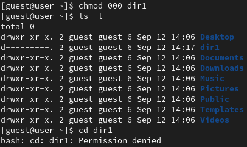{#fig:014 width=70%}

- `chmod 100` (рис. [-@fig:015]):

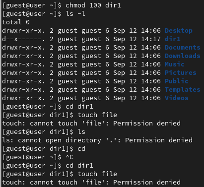{#fig:015 width=70%}

- `chmod 700` (рис. [-@fig:016]):

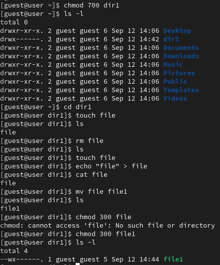{#fig:016 width=70%}

Заполним таблицу 2.2:

|Операция| |Минимальные  права на  директорию| |Минимальные  права на файл|
|-|-|-|-|-|
|Создание файла| |d(300)| |(000)|
|Удаление файла| |d(300)| |(000)|
|Чтение файла| |d(100)| |(400)|
|Запись в файл| |d(100)| |(200)|
|Переименование файла| |d(300)| |(000)|
|Создание поддиректории| |d(300)| |(000)|
|Удаление поддиректории| |d(300)| |(000)|

Таблица 2.2 "Минимальные права для совершения операций"

# Выводы

Я получила практические навыки работы в консоли с атрибутами файлов, закрепила теоретические основы дискреционного разграничения доступа в современных системах с открытым кодом на базе ОС Linux.

# Список литературы{.unnumbered}

::: {#refs}
:::
