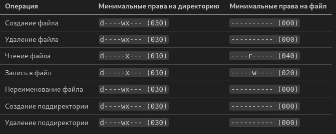

---
## Front matter
lang: ru-RU
title: Лабораторная работа №3
subtitle: Дискреционное разграничение прав в Linux. Два пользователя
author:
  - Латыпова Диана
institute:
  - Российский университет дружбы народов имени Патриса Лумумбы, Москва, Россия
date: 01 января 1970

## i18n babel
babel-lang: russian
babel-otherlangs: english

## Formatting pdf
toc: false
toc-title: Содержание
slide_level: 2
aspectratio: 169
section-titles: true
theme: metropolis
header-includes:
 - \metroset{progressbar=frametitle,sectionpage=progressbar,numbering=fraction}
---

# Информация

## Докладчик

:::::::::::::: {.columns align=center}
::: {.column width="70%"}

  * Латыпова Диана
  * студент группы НФИбд-02-21
  * Российский университет дружбы народов имени Патриса Лумумбы
  * [1032215005@rudn.ru](mailto:1032215005.ru)
  * <https://github.com/dlatypova>

:::
::: {.column width="30%"}


:::
::::::::::::::

# Вводная часть

## Цели и задачи

- Закрепление темы "Дискреционное разграничение прав в Linux"
- Получение практических навыков работы в консоли с атрибутами файлов для групп пользователей.

# Теоретическое введение

## Дискреционное разграничение прав в Linux

- относится к модели управления доступом, при которой владельцы объектов (файлов, каталогов) могут сами определять, кому и какие права предоставлять

- только владелец может изменять права доступа к файлу.

- используются команды **chmod** для изменения прав доступа и chown для изменения владельца файла.

## ACL (Access Control Lists)

- расширение стандартной модели прав, которое позволяет задавать более детальные настройки доступа для конкретных пользователей или групп

# Выполнение лабораторной работы

## Cоздание второго пользователя guest2

{#fig:001 width=40%}

## Добавление пользователя guest2 в группу guest

```gpasswd -a guest2 guest```

{#fig:002 width=40%}

## Команды groups и id

```groups guest и groups guest2``` - определение групп пользователей

```id``` - отображение реального и действующего идентификатора пользователя и идентификатора группы пользователя

{#fig:004 width=40%}

## Регистрация пользователя guest2 в группе guest

```newgrp guest```

{#fig:006 width=40%}

## Изменение прав и снятие атрибутов

```chmod g+rwx /home/guest``` 

```chmod 000 dirl```

{#fig:007 width=40%}

## Таблица 3.1

{#fig:007 width=55%}

## Таблица 3.2

{#fig:007 width=55%}

# Выводы

## Выводы

- Закреплена тема "Дискреционное разграничение прав в Linux"
- Получены практические навыки работы в консоли с атрибутами файлов для групп пользователей