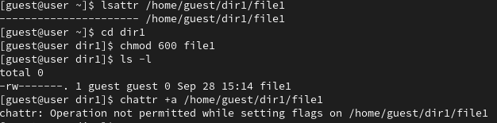
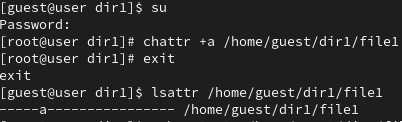
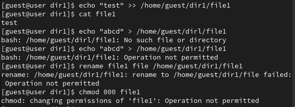
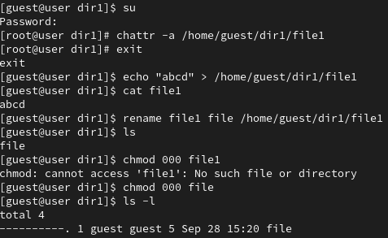
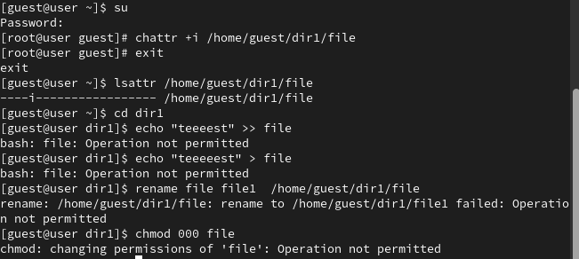

---
## Front matter
lang: ru-RU
title: Лабораторная работа №4
subtitle: Дискреционное разграничение прав в Linux. Расширенные атрибуты
author:
  - Латыпова Диана
institute:
  - Российский университет дружбы народов, Москва, Россия
date: 28 сентября 2024

## i18n babel
babel-lang: russian
babel-otherlangs: english

## Formatting pdf
toc: false
toc-title: Содержание
slide_level: 2
aspectratio: 169
section-titles: true
theme: metropolis
header-includes:
 - \metroset{progressbar=frametitle,sectionpage=progressbar,numbering=fraction}
---

# Информация

## Докладчик

:::::::::::::: {.columns align=center}
::: {.column width="70%"}

  * Латыпова Диана
  * студент НФИбд-02-21
  * Российский университет дружбы народов
  * [1032215005@rudn.ru](mailto:1032215005@rudn.ru)
  * <https://github.com/dlatypova>

:::
::: {.column width="30%"}

:::
::::::::::::::

# Вводная часть

## Цели и задачи

- Получение практических навыков работы в консоли с расширенными атрибутами файлов

# Теоретическое введение

## DAC

Linux использует **дискреционную политику безопасности (Discretionary Access Control, DAC)** для управления доступом к файлам и ресурсам.

Права доступа в Linux включают **три уровня**: для владельца файла, для группы и для остальных пользователей. Каждый уровень может иметь права на чтение (r), запись (w) и выполнение (x).

## Расширенные атрибуты

**Атрибут "a" (только добавление)**:

- позволяет только дозапись в файл, можно только читать или добавлять новые данные в конец файла

**Атрибут "i" (неизменяемый)**:

- делает файл или каталог полностью неизменяемым, файл нельзя изменять, удалять, переименовывать или выполнять запись в него

# Выполнение лабораторной работы

## Задания 1-3

- `lsattr` — отображает текущие расширенные атрибуты файла.

- `chattr` — изменяет расширенные атрибуты файла. С помощью этой команды можно устанавливать или снимать атрибуты.

{#fig:001 width=40%}

## Задания 4-5

`chattr +a /home/guest/dir1/file1`

{#fig:002 width=40%}

## Задания 6-8

{#fig:003 width=50%}

## Задание 9

`chattr -a /home/guest/dir1/file1`

{#fig:004 width=40%}

## Задания 10

`chattr +i /home/guest/dir1/file1`

{#fig:005 width=40%}

# Выводы

## Выводы

- Повышены навыки использования интерфейса командой строки (CLI)
- Связана теория дискреционного разделения
доступа (дискреционная политика безопасности) с её реализацией на практике в ОС Linux
- Опробованы действия на практике расширенных атрибутов «а» и «i».

