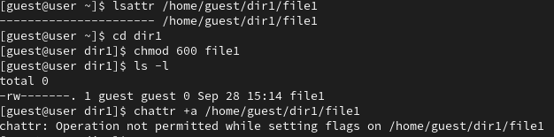
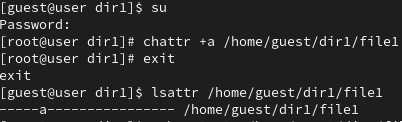
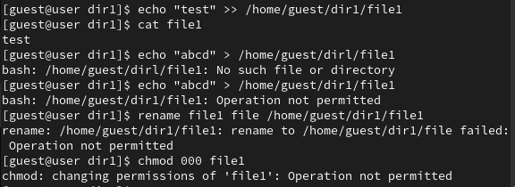
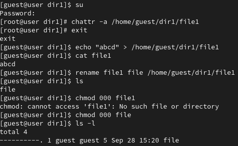
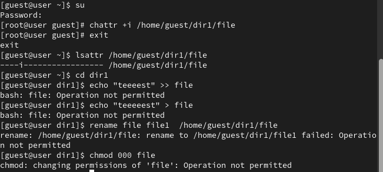

---
## Front matter
title: "Лабораторная работа №4"
subtitle: "Дискреционное разграничение прав в Linux. Расширенные атрибуты"
author: "Латыпова Диана. НФИбд-02-21"

## Generic otions
lang: ru-RU
toc-title: "Содержание"

## Bibliography
bibliography: bib/cite.bib
csl: pandoc/csl/gost-r-7-0-5-2008-numeric.csl

## Pdf output format
toc: true # Table of contents
toc-depth: 2
lof: true # List of figures
lot: true # List of tables
fontsize: 12pt
linestretch: 1.5
papersize: a4
documentclass: scrreprt
## I18n polyglossia
polyglossia-lang:
  name: russian
  options:
	- spelling=modern
	- babelshorthands=true
polyglossia-otherlangs:
  name: english
## I18n babel
babel-lang: russian
babel-otherlangs: english
## Fonts
mainfont: IBM Plex Serif
romanfont: IBM Plex Serif
sansfont: IBM Plex Sans
monofont: IBM Plex Mono
mathfont: STIX Two Math
mainfontoptions: Ligatures=Common,Ligatures=TeX,Scale=0.94
romanfontoptions: Ligatures=Common,Ligatures=TeX,Scale=0.94
sansfontoptions: Ligatures=Common,Ligatures=TeX,Scale=MatchLowercase,Scale=0.94
monofontoptions: Scale=MatchLowercase,Scale=0.94,FakeStretch=0.9
mathfontoptions:
## Biblatex
biblatex: true
biblio-style: "gost-numeric"
biblatexoptions:
  - parentracker=true
  - backend=biber
  - hyperref=auto
  - language=auto
  - autolang=other*
  - citestyle=gost-numeric
## Pandoc-crossref LaTeX customization
figureTitle: "Рис."
tableTitle: "Таблица"
listingTitle: "Листинг"
lofTitle: "Список иллюстраций"
lotTitle: "Список таблиц"
lolTitle: "Листинги"
## Misc options
indent: true
header-includes:
  - \usepackage{indentfirst}
  - \usepackage{float} # keep figures where there are in the text
  - \floatplacement{figure}{H} # keep figures where there are in the text
---

# Цель работы

Получение практических навыков работы в консоли с расширенными атрибутами файлов.

# Задание

1. От имени пользователя guest определите расширенные атрибуты файла
`/home/guest/dir1/file1` командой
```
lsattr /home/guest/dir1/file1
```
2. Установите командой
```
chmod 600 file1
```
на файл file1 права, разрешающие чтение и запись для владельца файла.
3. Попробуйте установить на файл `/home/guest/dir1/file1` расширенный атрибут a от имени пользователя guest:
```
chattr +a /home/guest/dir1/file1
```
В ответ вы должны получить отказ от выполнения операции.
4. Зайдите на третью консоль с правами администратора либо повысьте
свои права с помощью команды `su`. Попробуйте установить расширенный атрибут a на файл /`home/guest/dir1/file1` от имени суперпользователя:
```
chattr +a /home/guest/dir1/file1
```
5. От пользователя guest проверьте правильность установления атрибута:
```
lsattr /home/guest/dir1/file1
```
6. Выполните дозапись в файл file1 слова «test» командой
```
echo "test" /home/guest/dir1/file1
```
После этого выполните чтение файла file1 командой
```
cat /home/guest/dir1/file1
```
Убедитесь, что слово test было успешно записано в file1.
7. Попробуйте удалить файл file1 либо стереть имеющуюся в нём информацию командой
```
echo "abcd" > /home/guest/dirl/file1
```
Попробуйте переименовать файл.
8. Попробуйте с помощью команды
```
chmod 000 file1
```
установить на файл file1 права, например, запрещающие чтение и запись для владельца файла. Удалось ли вам успешно выполнить указанные команды?
9. Снимите расширенный атрибут a с файла `/home/guest/dirl/file1` от
имени суперпользователя командой
```
chattr -a /home/guest/dir1/file1
```
Повторите операции, которые вам ранее не удавалось выполнить. Ваши
наблюдения занесите в отчёт.
10. Повторите ваши действия по шагам, заменив атрибут «a» атрибутом «i».
Удалось ли вам дозаписать информацию в файл? Ваши наблюдения занесите в отчёт


# Теоретическое введение

Linux использует **дискреционную политику безопасности (Discretionary Access Control, DAC)** для управления доступом к файлам и ресурсам. В рамках DAC владельцы объектов (файлов или каталогов) могут на своё усмотрение изменять права доступа к ним, а также применять расширенные атрибуты для обеспечения дополнительной защиты [@linux:bash].

Права доступа в Linux включают **три уровня**: для владельца файла, для группы и для остальных пользователей. Каждый уровень может иметь права на чтение (r), запись (w) и выполнение (x).

Помимо стандартных прав, в Linux существует возможность использования **расширенных атрибутов** файлов. Они позволяют дополнительно ограничивать или расширять доступ к файлам, управляя действиями, которые могут быть выполнены с ними. Два основных атрибута, часто используемых в этой связи — это атрибуты **a (append-only) и i (immutable)** [@manage:bash]:

- Атрибут "a" (только добавление):

Этот атрибут позволяет только дозапись в файл, запрещая изменение или удаление существующего содержимого. С файла с атрибутом "a" можно только читать или добавлять новые данные в конец файла. Это полезно для журналов или логов, где необходимо сохранять все записи.

- Атрибут "i" (неизменяемый):

Установка этого атрибута делает файл или каталог полностью неизменяемым. После установки атрибута "i" файл нельзя будет изменять, удалять, переименовывать или выполнять запись в него. Это полезно для защиты важных конфигурационных файлов от случайных изменений или удаления.

**Основные команды:**

- `lsattr` — отображает текущие расширенные атрибуты файла.
- `chattr` — изменяет расширенные атрибуты файла. С помощью этой команды можно устанавливать или снимать атрибуты.
- `chmod` — используется для изменения стандартных прав доступа к файлам.

*Примеры атрибутов:*

+a — устанавливает атрибут "append-only".

-a — снимает атрибут "append-only".

+i — устанавливает атрибут "immutable".

-i — снимает атрибут "immutable".

# Выполнение лабораторной работы

Для начала от имени пользователя guest определила расширенные атрибуты файла
`/home/guest/dir1/file1` командой
```
lsattr /home/guest/dir1/file1
```
Далее установила командой
```
chmod 600 file1
```
на файл file1 права, разрешающие чтение и запись для владельца файла.
И попробовав установить на файл `/home/guest/dir1/file1` расширенный атрибут a от имени пользователя guest:
```
chattr +a /home/guest/dir1/file1
```
В ответ получила отказ от выполнения операции(рис. [-@fig:001]):

{#fig:001 width=70%}

Затем повысила свои права с помощью команды `su`. Установила расширенный атрибут a на файл /`home/guest/dir1/file1` от имени суперпользователя:
```
chattr +a /home/guest/dir1/file1
```
Вышла, и от пользователя guest проверила правильность установления атрибута(рис. [-@fig:002]):
```
lsattr /home/guest/dir1/file1
```

{#fig:002 width=70%}

Выполнила дозапись в файл file1 слова «test» командой
```
echo "test" > /home/guest/dir1/file1
```
После этого выполнила чтение файла file1 командой
```
cat /home/guest/dir1/file1
```
Слово test было успешно записано в file1. Попробова удалить файл file1 либо стереть имеющуюся в нём информацию командой, но ничего не вышло:
```
echo "abcd" > /home/guest/dirl/file1
```
Попробовала переименовать файл, также не вышло. Попробовала с помощью команды
```
chmod 000 file1
```
установить на файл file1 права, например, запрещающие чтение и запись для владельца файла, но и этого не вышло (рис. [-@fig:003]):

{#fig:003 width=70%}

Сняла расширенный атрибут a с файла `/home/guest/dirl/file1` от
имени суперпользователя командой
```
chattr -a /home/guest/dir1/file1
```
Повторила операции, которые ранее не удавалось выполнить.Все команды выполнились (рис. [-@fig:004]):

{#fig:004 width=70%}

Повторила предыдущие действия по шагам, заменив атрибут «a» атрибутом «i».
Но ничего не удалось выполнить (рис. [-@fig:005]):

{#fig:005 width=70%}

# Выводы

В результате выполнения работы я повысила свои навыки использования интерфейса командой строки (CLI), познакомилась на примерах с тем,
как используются основные и расширенные атрибуты при разграничении
доступа. Имела возможность связать теорию дискреционного разделения
доступа (дискреционная политика безопасности) с её реализацией на практике в ОС Linux. Опробовала действие на практике расширенных атрибутов «а» и «i».

# Список литературы{.unnumbered}

::: {#refs}
:::
