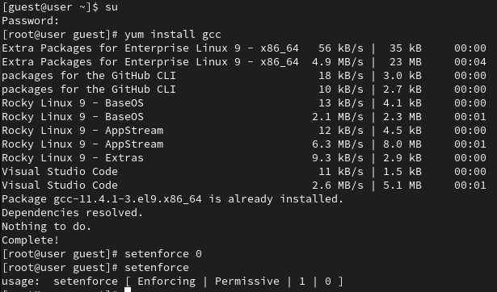
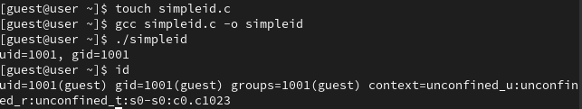
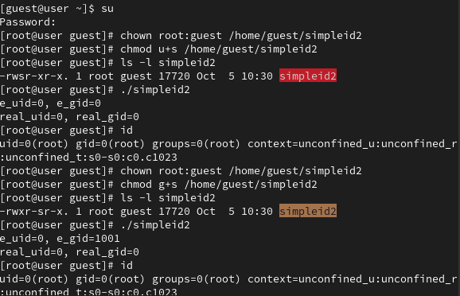
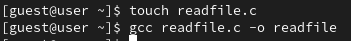
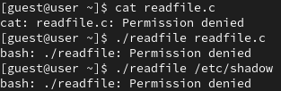
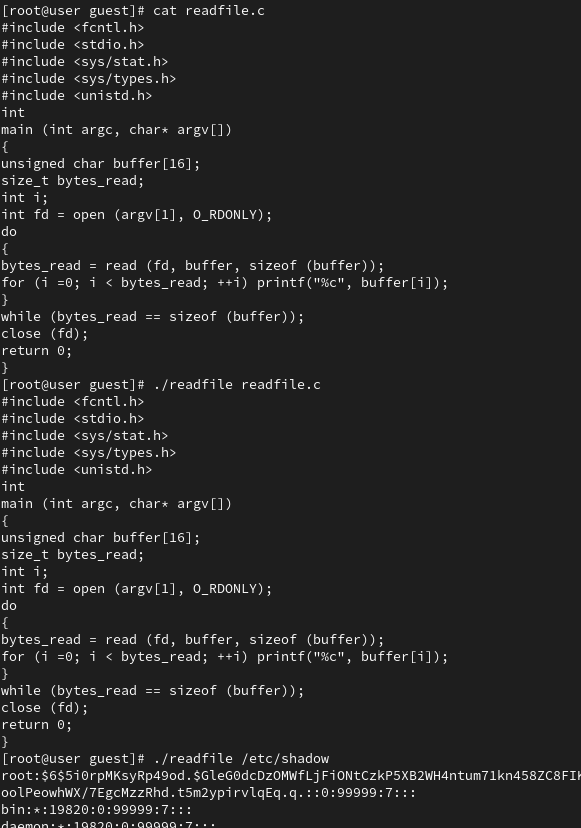
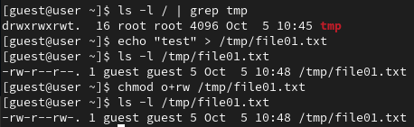
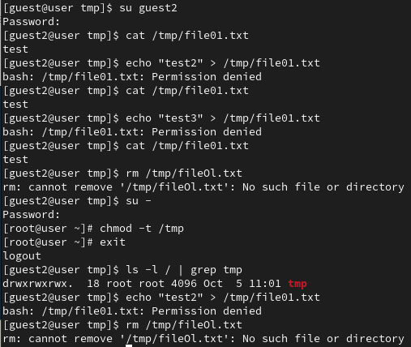
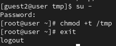

---
## Front matter
lang: ru-RU
title: Лабораторная работа №5
subtitle: Дискреционное разграничение прав в Linux. Исследование влияния дополнительных атрибутов
author:
  - Латыпова Диана
institute:
  - Российский университет дружбы народов, Москва, Россия
date: 5 октября 2024

## i18n babel
babel-lang: russian
babel-otherlangs: english

## Formatting pdf
toc: false
toc-title: Содержание
slide_level: 2
aspectratio: 169
section-titles: true
theme: metropolis
header-includes:
 - \metroset{progressbar=frametitle,sectionpage=progressbar,numbering=fraction}
---

# Информация

## Докладчик

:::::::::::::: {.columns align=center}
::: {.column width="70%"}

  * Латыпова Диана
  * студент группы НФИбд-02-21
  * Российский университет дружбы народов
  * [1032215005@rudn.ru](mailto:1032215005@rudn.ru)
  * <https://github.com/dlatypova>

:::
::: {.column width="30%"}


:::
::::::::::::::

# Вводная часть

## Цели и задачи

- Изучение механизмов изменения идентификаторов, применения
SetUID- и Sticky-битов
- Получение практических навыков работы в консоли с дополнительными атрибутами
- Рассмотрение влияния бита Sticky на запись и удаление файлов

# Теоретическое введение

## Теоретическое введение (1)

- **UID (User ID)** — идентификатор пользователя, который определяет, от имени какого пользователя выполняется программа
- **GID (Group ID)** — идентификатор группы, определяющий группу, к которой принадлежит пользователь

## Теоретическое введение (2)

- **SetUID** — специальный бит, который при установке на файл исполняемой программы позволяет запускать её с правами владельца файла
- **SetGID** работает аналогично, но изменяет эффективный GID на GID владельца файла

**Sticky-bit** — атрибут директории, который запрещает пользователям удалять файлы, если они не являются их владельцами

# Выполнение лабораторной работы

## Установка компилятора gcc

{#fig:001 width=50%}

## Создание и компиляция файла

{#fig:002 width=50%}

## Команды chown и chmod

```
chown root:guest /home/guest/simpleid2
chmod u+s /home/guest/simpleid2
chmod g+s /home/guest/simpleid2
```

{#fig:004 width=30%}

## Изменение прав

{#fig:004 width=50%}

## Проверка изменения прав (1)

{#fig:007 width=50%}

## Проверка изменения прав (2)

{#fig:008 width=50%}

## Исследование sticky-бита (1)

```
chmod o+rw /tmp/file01.txt
```

{#fig:009 width=40%}

## Исследование sticky-бита (2)

```
chmod -t /tmp
```

{#fig:010 width=40%}

## Исследование sticky-бита (3)

```
chmod +t /tmp
```

{#fig:011 width=50%}

# Выводы

## Выводы

- Изучиены механизмы изменения идентификаторов, применения
SetUID- и Sticky-битов
- Получены практические навыки работы в консоли с дополнительными атрибутами
- Рассмотрено влияние бита Sticky на запись и удаление файлов