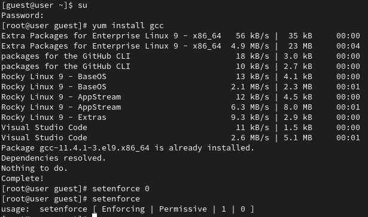
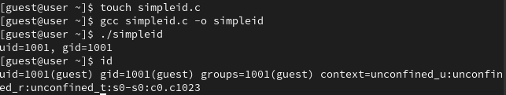
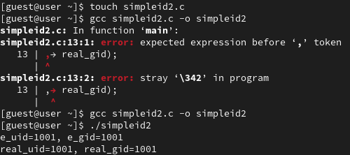
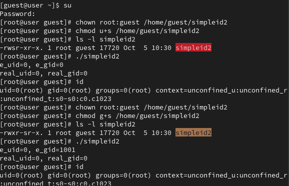
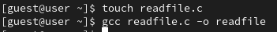
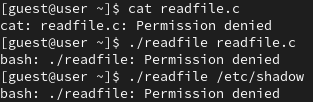
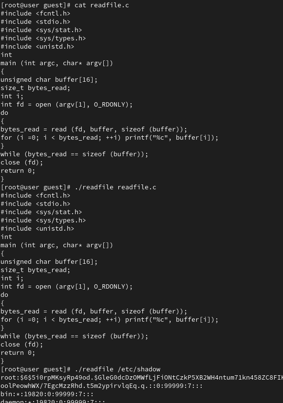
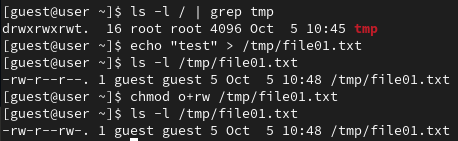
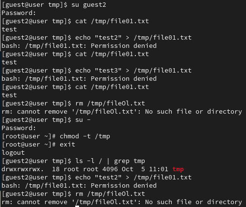
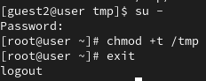

---
## Front matter
title: "Лабораторная работа №5"
subtitle: "Дискреционное разграничение прав в Linux. Исследование влияния дополнительных атрибутов"
author: "Латыпова Диана. НФИбд-02-21"

## Generic otions
lang: ru-RU
toc-title: "Содержание"

## Bibliography
bibliography: bib/cite.bib
csl: pandoc/csl/gost-r-7-0-5-2008-numeric.csl

## Pdf output format
toc: true # Table of contents
toc-depth: 2
lof: true # List of figures
lot: true # List of tables
fontsize: 12pt
linestretch: 1.5
papersize: a4
documentclass: scrreprt
## I18n polyglossia
polyglossia-lang:
  name: russian
  options:
	- spelling=modern
	- babelshorthands=true
polyglossia-otherlangs:
  name: english
## I18n babel
babel-lang: russian
babel-otherlangs: english
## Fonts
mainfont: IBM Plex Serif
romanfont: IBM Plex Serif
sansfont: IBM Plex Sans
monofont: IBM Plex Mono
mathfont: STIX Two Math
mainfontoptions: Ligatures=Common,Ligatures=TeX,Scale=0.94
romanfontoptions: Ligatures=Common,Ligatures=TeX,Scale=0.94
sansfontoptions: Ligatures=Common,Ligatures=TeX,Scale=MatchLowercase,Scale=0.94
monofontoptions: Scale=MatchLowercase,Scale=0.94,FakeStretch=0.9
mathfontoptions:
## Biblatex
biblatex: true
biblio-style: "gost-numeric"
biblatexoptions:
  - parentracker=true
  - backend=biber
  - hyperref=auto
  - language=auto
  - autolang=other*
  - citestyle=gost-numeric
## Pandoc-crossref LaTeX customization
figureTitle: "Рис."
tableTitle: "Таблица"
listingTitle: "Листинг"
lofTitle: "Список иллюстраций"
lotTitle: "Список таблиц"
lolTitle: "Листинги"
## Misc options
indent: true
header-includes:
  - \usepackage{indentfirst}
  - \usepackage{float} # keep figures where there are in the text
  - \floatplacement{figure}{H} # keep figures where there are in the text
---

# Цель работы

Изучение механизмов изменения идентификаторов, применения
SetUID- и Sticky-битов. Получение практических навыков работы в консоли с дополнительными атрибутами. Рассмотрение работы механизма
смены идентификатора процессов пользователей, а также влияние бита
Sticky на запись и удаление файлов.

# Задание

**5.3.1. Создание программы**

1. Войдите в систему от имени пользователя guest.
2. Создайте программу simpleid.c
3. Скомплилируйте программу и убедитесь, что файл программы создан:
```
gcc simpleid.c -o simpleid
```
4. Выполните программу simpleid:
`./simpleid`
5. Выполните системную программу id:
`id`
и сравните полученный вами результат с данными предыдущего пункта
задания.
6. Усложните программу, добавив вывод действительных идентификаторов. Получившуюся программу назовите simpleid2.c.
7. Скомпилируйте и запустите simpleid2.c:
```
gcc simpleid2.c -o simpleid2
./simpleid2
```
8. От имени суперпользователя выполните команды
```
chown root:guest /home/guest/simpleid2
chmod u+s /home/guest/simpleid2
```
9. Используйте sudo или повысьте временно свои права с помощью su.
Поясните, что делают эти команды.
10. Выполните проверку правильности установки новых атрибутов и смены
владельца файла simpleid2:
`ls -l simpleid2`
11. Запустите simpleid2 и id:
```
./simpleid2
id
```
Сравните результаты.
12. Проделайте тоже самое относительно SetGID-бита.
13. Создайте программу readfile.c.
14. Откомпилируйте её.
```
gcc readfile.c -o readfile
```
15. Смените владельца у файла readfile.c (или любого другого текстового
файла в системе) и измените права так, чтобы только суперпользователь
(root) мог прочитать его, a guest не мог.
16. Проверьте, что пользователь guest не может прочитать файл readfile.c.
17. Смените у программы readfile владельца и установите SetU’D-бит.
18. Проверьте, может ли программа readfile прочитать файл readfile.c?
19. Проверьте, может ли программа readfile прочитать файл `/etc/shadow`?
Отразите полученный результат и ваши объяснения в отчёте.

**5.3.2. Исследование Sticky-бита**

1. Выясните, установлен ли атрибут Sticky на директории /tmp, для чего
выполните команду
`ls -l / | grep tmp`
2. От имени пользователя guest создайте файл file01.txt в директории /tmp
со словом test:
`echo "test" > /tmp/file01.txt`
3. Просмотрите атрибуты у только что созданного файла и разрешите чтение и запись для категории пользователей «все остальные»:
```
ls -l /tmp/file01.txt
chmod o+rw /tmp/file01.txt
ls -l /tmp/file01.txt
```
4. От пользователя guest2 (не являющегося владельцем) попробуйте прочитать файл /tmp/file01.txt:
`cat /tmp/file01.txt`
5. От пользователя guest2 попробуйте дозаписать в файл
/tmp/file01.txt слово test2 командой
`echo "test2" > /tmp/file01.txt`
Удалось ли вам выполнить операцию?
6. Проверьте содержимое файла командой
`cat /tmp/file01.txt`
7. От пользователя guest2 попробуйте записать в файл /tmp/file01.txt
слово test3, стерев при этом всю имеющуюся в файле информацию командой
`echo "test3" > /tmp/file01.txt`
Удалось ли вам выполнить операцию?
8. Проверьте содержимое файла командой
`cat /tmp/file01.txt`
9. От пользователя guest2 попробуйте удалить файл /tmp/file01.txt командой
`rm /tmp/fileOl.txt`
Удалось ли вам удалить файл?
10. Повысьте свои права до суперпользователя следующей командой
`su -`
и выполните после этого команду, снимающую атрибут t (Sticky-бит) с
директории /tmp:
```
chmod -t /tmp
```
11. Покиньте режим суперпользователя командой
exit
12. От пользователя guest2 проверьте, что атрибута t у директории /tmp
нет:
`ls -l / | grep tmp`
13. Повторите предыдущие шаги. Какие наблюдаются изменения?
14. Удалось ли вам удалить файл от имени пользователя, не являющегося
его владельцем? Ваши наблюдения занесите в отчёт.
15. Повысьте свои права до суперпользователя и верните атрибут t на директорию /tmp:
```
su -
chmod +t /tmp
exit
```

# Теоретическое введение

- **UID (User ID)** — идентификатор пользователя, который определяет, от имени какого пользователя выполняется программа[@uidandgid:bash].
- **GID (Group ID)** — идентификатор группы, определяющий группу, к которой принадлежит пользователь [@uidandgid:bash].

Программы могут выполняться с различными идентификаторами: действительный (реальный) и эффективный UID/GID. *Реальный UID* — это пользователь, который запустил процесс, а *эффективный UID* — это пользователь, от имени которого процесс выполняет операции.

- **SetUID** — специальный бит, который при установке на файл исполняемой программы позволяет запускать её с правами владельца файла, а не того пользователя, который её запускает [@linux:bash].

- **SetGID** работает аналогично, но изменяет эффективный GID на GID владельца файла [@linux:bash].

**Sticky-bit** — атрибут директории, который запрещает пользователям удалять файлы, если они не являются их владельцами, даже если у них есть права на запись в директорию[@linux:bash].

# Выполнение лабораторной работы

Для начала установили компилятор gcc (рис. [-@fig:001]):

{#fig:001 width=70%}

Вошла в систему от имени пользователя guest, создала программу simpleid.c:
```
#include <sys/types.h>   // Для использования типов данных UID и GID
#include <unistd.h>      // Для функций getuid(), geteuid(), getgid(), getegid()
#include <stdio.h>       // Для функции printf()

int main () {
    // Получение эффективных идентификаторов пользователя и группы
    uid_t uid = geteuid();  // Получение эффективного UID
    gid_t gid = getegid();  // Получение эффективного GID
    
    // Вывод эффективных идентификаторов
    printf("uid=%d, gid=%d\n", uid, gid);
    
    return 0;
}
```

Скомплилировала программу, выполнила программу simpleid и системную программу id:
```
gcc simpleid.c -o simpleid
./simpleid
id
```
Видим, что UID и GID совпдают(рис. [-@fig:002]):

{#fig:002 width=70%}

Далее усложнила программу, добавив вывод действительных идентификаторов:
```
#include <sys/types.h>   // Для использования типов данных UID и GID
#include <unistd.h>      // Для функций getuid(), geteuid(), getgid(), getegid()
#include <stdio.h>       // Для функции printf()

int main () {
    // Получение реальных и эффективных идентификаторов пользователя и группы
    uid_t real_uid = getuid();    // Получение реального UID
    uid_t e_uid = geteuid();      // Получение эффективного UID
    gid_t real_gid = getgid();    // Получение реального GID
    gid_t e_gid = getegid();      // Получение эффективного GID

    // Вывод реальных и эффективных идентификаторов
    printf("e_uid=%d, e_gid=%d\n", e_uid, e_gid);
    printf("real_uid=%d, real_gid=%d\n", real_uid, real_gid);

    return 0;
}

```

Получившуюся программу назвала simpleid2.c, скомпилировала и запустила simpleid2.c (рис. [-@fig:003]):

{#fig:003 width=70%}


От имени суперпользователя выполнила команды
```
chown root:guest /home/guest/simpleid2
chmod u+s /home/guest/simpleid2
```
Команда chown меняет владельца файла, а chmod u+s устанавливает SetUID бит, что позволяет выполнять программу с правами владельца (root). Далее выполнила проверку правильности установки новых атрибутов и смены
владельца файла simpleid2. Ну и запустила simpleid2 и id.
Проделала то же самое относительно SetGID-бита (рис. [-@fig:004]):

```
chown root:guest /home/guest/simpleid2
chmod g+s /home/guest/simpleid2
```

{#fig:004 width=70%}

Создала программу readfile.c:
```
#include <fcntl.h>       // Для функции open()
#include <stdio.h>       // Для функции printf()
#include <sys/stat.h>    // Для работы с атрибутами файлов
#include <sys/types.h>   // Для использования типов данных
#include <unistd.h>      // Для функций read(), close()

int main (int argc, char* argv[]) {
    unsigned char buffer[16];      // Буфер для хранения прочитанных данных
    size_t bytes_read;             // Количество прочитанных байт
    int i;
    int fd = open(argv[1], O_RDONLY);   // Открытие файла на чтение
    
    do {
        bytes_read = read(fd, buffer, sizeof(buffer));  // Чтение данных из файла
        for (i = 0; i < bytes_read; ++i) {
            printf("%c", buffer[i]);  // Вывод прочитанных данных
        }
    } while (bytes_read == sizeof(buffer));  // Чтение продолжается до конца файла
    
    close(fd);  // Закрытие файла
    return 0;
}
```

Откомпилировала её (рис. [-@fig:005]):

{#fig:005 width=70%}

Сменила владельца у файла readfile.c и изменила права так, чтобы только суперпользователь
(root) мог прочитать его, a guest не мог (рис. [-@fig:006]):

{#fig:006 width=70%}

Проверила, что пользователь guest не может прочитать файл readfile.c,сменила у программы readfile владельца и установила SetU’D-бит. Проверила, может ли программа readfile прочитать файл readfile.c. Проверила, может ли программа readfile прочитать файл `/etc/shadow`?
Ничего из выше перечисленного прочитать не смогли (рис. [-@fig:007]):

{#fig:007 width=70%}

Видим, что только суперпользователь может выполнить вышеперечисленное(рис. [-@fig:008]):

{#fig:008 width=70%}

Начали исследование sticky-бита.

Выяснила, установлен ли атрибут Sticky на директории /tmp, для чего
выполнила команду:
```
ls -l / | grep tmp
```
От имени пользователя guest создала файл file01.txt в директории /tmp
со словом test:
```
echo "test" > /tmp/file01.txt
```
Просмотрела атрибуты у только что созданного файла и разрешила чтение и запись для категории пользователей «все остальные» (рис. [-@fig:009]):
```
ls -l /tmp/file01.txt
chmod o+rw /tmp/file01.txt
ls -l /tmp/file01.txt
```
От пользователя guest2 (не являющегося владельцем) попробовала прочитать файл /tmp/file01.txt:
```
cat /tmp/file01.txt
```

{#fig:009 width=70%}

От пользователя guest2 попробовала дозаписать в файл
/tmp/file01.txt слово test2. Однако мне этого не удалось сделать. От пользователя guest2 попробовала записать в файл /tmp/file01.txt
слово test3, стерев при этом всю имеющуюся в файле информацию, этого тоже не удалось сделать. От пользователя guest2 попробовала удалить файл /tmp/file01.txt, этого тоже не удалось сделать. После чего повысила свои права до суперпользователя
и выполнила после этого команду, снимающую атрибут t (Sticky-бит) с
директории /tmp:
```
chmod -t /tmp
```
Покинула режим суперпользователя. Повторила предыдущие шаги. Но сколько бы ни старалась, изменений не видно. Удалить файл от имени пользователя, не являющегося
его владельцем не получилось (рис. [-@fig:010]):

{#fig:010 width=70%}

После всего повысила свои права до суперпользователя и вернула атрибут t на директорию /tmp:
```
su -
chmod +t /tmp
exit
```
(рис. [-@fig:011]):

{#fig:011 width=70%}

# Выводы

Я изучила механизмы изменения идентификаторов, применения
SetUID- и Sticky-битов. Получила практические навыки работы в консоли с дополнительными атрибутами. А также рассмотрела работу механизма
смены идентификатора процессов пользователей, и влияние бита
Sticky на запись и удаление файлов.

# Список литературы{.unnumbered}

::: {#refs}
:::
