---
## Front matter
lang: ru-RU
title: Лабораторная работа №6
subtitle: Мандатное разграничение прав в Linux
author:
  - Латыпова Диана
institute:
  - Российский университет дружбы народов, Москва, Россия
date: 12 октября 2024

## i18n babel
babel-lang: russian
babel-otherlangs: english

## Formatting pdf
toc: false
toc-title: Содержание
slide_level: 2
aspectratio: 169
section-titles: true
theme: metropolis
header-includes:
 - \metroset{progressbar=frametitle,sectionpage=progressbar,numbering=fraction}
---

# Информация

## Докладчик

:::::::::::::: {.columns align=center}
::: {.column width="70%"}

  * Латыпова Диана
  * студент группы НФИбд-02-21
  * Российский университет дружбы народов
  * [1032215005@rudn.ru](mailto:1032215005@rudn.ru)
  * <https://github.com/dlatypova>

:::
::: {.column width="30%"}

:::
::::::::::::::

# Вводная часть

## Цели и задачи

- Развить навыки администрирования ОС Linux
- Получить первое практическое знакомство с технологией SELinux
- Проверить работу SELinx на практике совместно с веб-сервером Apache

# Теоретическая справка

## SELinux (Security-Enhanced Linux)

- система управления доступом на уровне ядра, которая реализует обязательное управление доступом (MAC) в операционных системах Linux.

Использует три режима работы:

- Enforcing
- Permissive
- Disabled

Команды для управления и проверки статуса:

- getenforce 
- sestatus

##  Apache

- один из самых популярных веб-серверов, который используется для обслуживания веб-сайтов и приложений

При работе с веб-сервером и SELinux важно отслеживать логи:

- /var/log/messages
- /var/log/httpd/error_log 
- /var/log/audit/audit.log

# Выполнение лабораторной работы

## Команды`getenforce` и `sestatus`

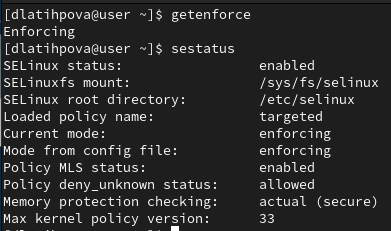{#fig:001 width=40%}

## `service httpd status`

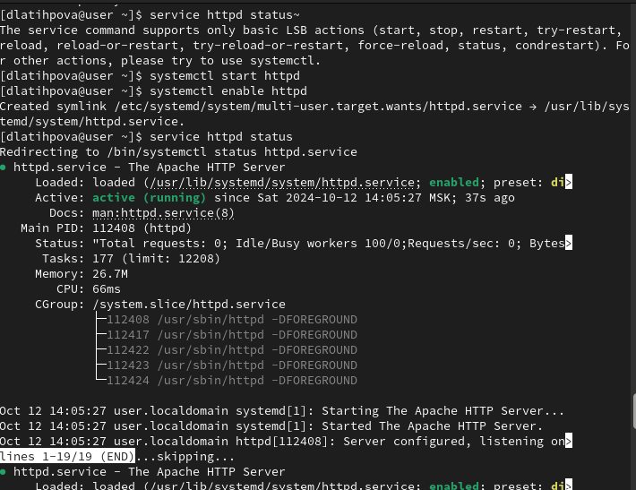{#fig:002 width=40%}

## Текущее состояние переключателей SELinux для Apache

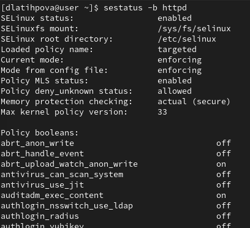{#fig:003 width=40%}

## Поросмотр статистики по политике

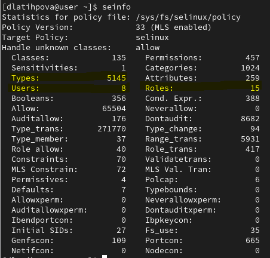{#fig:004 width=40%}

##  Команда `ls -Z`

- `ls -Z /var/www/html/test.html` — показывает контекст безопасности файла

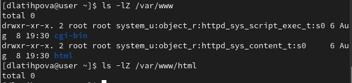{#fig:005 width=40%}

## Файл test.html (1)

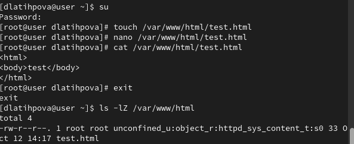{#fig:006 width=40%}

## Файл test.html (2)

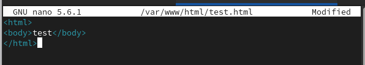{#fig:007 width=30%}

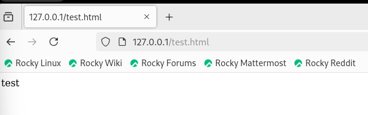{#fig:009 width=30%}

## Команда `chcon`

- `chcon -t` — изменяет тип контекста

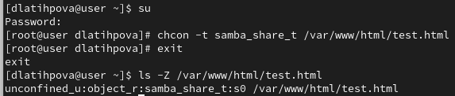{#fig:008 width=40%}

## Просмотр log-файлов веб-сервера Apache

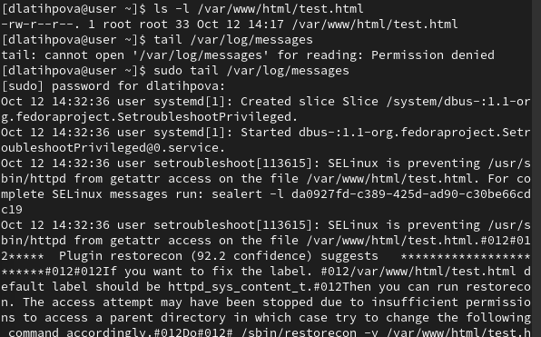{#fig:009 width=40%}

## Работа с портами

- `semanage port -a -t` — добавляет порт к списку допустимых для Apache
- `semanage port -l | grep http_port_t` - просмотр списка портов, разрешённых SELinux
- `semanage port -d -t http_port_t -p` - удаляет привязку порта

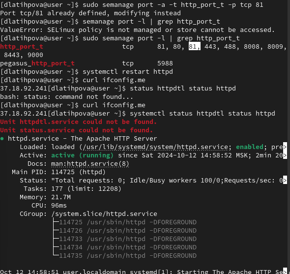{#fig:010 width=30%}

# Выводы

## Выводы

- Развиты навыки администрирования ОС Linux
- Получено первое практическое знакомство с технологией SELinux
- Проверена работа SELinx на практике совместно с веб-сервером Apache
