---
## Front matter
title: "Лаораторная работа №6"
subtitle: "Мандатное разграничение прав в Linux"
author: "Латыпова Диана. НФИбд-02-21"

## Generic otions
lang: ru-RU
toc-title: "Содержание"

## Bibliography
bibliography: bib/cite.bib
csl: pandoc/csl/gost-r-7-0-5-2008-numeric.csl

## Pdf output format
toc: true # Table of contents
toc-depth: 2
lof: true # List of figures
lot: true # List of tables
fontsize: 12pt
linestretch: 1.5
papersize: a4
documentclass: scrreprt
## I18n polyglossia
polyglossia-lang:
  name: russian
  options:
	- spelling=modern
	- babelshorthands=true
polyglossia-otherlangs:
  name: english
## I18n babel
babel-lang: russian
babel-otherlangs: english
## Fonts
mainfont: IBM Plex Serif
romanfont: IBM Plex Serif
sansfont: IBM Plex Sans
monofont: IBM Plex Mono
mathfont: STIX Two Math
mainfontoptions: Ligatures=Common,Ligatures=TeX,Scale=0.94
romanfontoptions: Ligatures=Common,Ligatures=TeX,Scale=0.94
sansfontoptions: Ligatures=Common,Ligatures=TeX,Scale=MatchLowercase,Scale=0.94
monofontoptions: Scale=MatchLowercase,Scale=0.94,FakeStretch=0.9
mathfontoptions:
## Biblatex
biblatex: true
biblio-style: "gost-numeric"
biblatexoptions:
  - parentracker=true
  - backend=biber
  - hyperref=auto
  - language=auto
  - autolang=other*
  - citestyle=gost-numeric
## Pandoc-crossref LaTeX customization
figureTitle: "Рис."
tableTitle: "Таблица"
listingTitle: "Листинг"
lofTitle: "Список иллюстраций"
lotTitle: "Список таблиц"
lolTitle: "Листинги"
## Misc options
indent: true
header-includes:
  - \usepackage{indentfirst}
  - \usepackage{float} # keep figures where there are in the text
  - \floatplacement{figure}{H} # keep figures where there are in the text
---

# Цель работы

Развить навыки администрирования ОС Linux. Получить первое практическое знакомство с технологией SELinux. Проверить работу SELinx на практике совместно с веб-сервером Apache.

# Задание

1. Войдите в систему с полученными учётными данными и убедитесь, что SELinux работает в режиме enforcing политики targeted с помощью команд `getenforce` и `sestatus`.
2. Обратитесь с помощью браузера к веб-серверу, запущенному на вашем компьютере, и убедитесь, что последний работает:
`service httpd status`
или
`/etc/rc.d/init.d/httpd status`
Если не работает, запустите его так же, но с параметром start.
3. Найдите веб-сервер Apache в списке процессов, определите его контекст безопасности и занесите эту информацию в отчёт. Например, можно использовать команду
`ps auxZ | grep httpd`
или
`ps -eZ | grep httpd`
4. Посмотрите текущее состояние переключателей SELinux для Apache с
помощью команды
```
sestatus -bigrep httpd
```
Обратите внимание, что многие из них находятся в положении «off».
5. Посмотрите статистику по политике с помощью команды `seinfo`, также определите множество пользователей, ролей, типов.
6. Определите тип файлов и поддиректорий, находящихся в директории
/var/www, с помощью команды
```
ls -lZ /var/www
```
7. Определите тип файлов, находящихся в директории /var/www/html:
```
ls -lZ /var/www/html
```
8. Определите круг пользователей, которым разрешено создание файлов в
директории /var/www/html.
9. Создайте от имени суперпользователя (так как в дистрибутиве после установки только ему разрешена запись в директорию) html-файл
/var/www/html/test.html следующего содержания:
```
<html>
<body>test</body>
</html>
```
10. Проверьте контекст созданного вами файла. Занесите в отчёт контекст,
присваиваемый по умолчанию вновь созданным файлам в директории
/var/www/html.
11. Обратитесь к файлу через веб-сервер, введя в браузере адрес
http://127.0.0.1/test.html. Убедитесь, что файл был успешно отображён.
12. Изучите справку man httpd_selinux и выясните, какие контексты файлов определены для httpd. Сопоставьте их с типом файла
test.html. Проверить контекст файла можно командой ls -Z.
```
ls -Z /var/www/html/test.html
```
Рассмотрим полученный контекст детально. Обратите внимание, что так
как по умолчанию пользователи CentOS являются свободными от типа
(unconfined в переводе с англ. означает свободный), созданному нами
файлу test.html был сопоставлен SELinux, пользователь unconfined_u.
Это первая часть контекста.
Далее политика ролевого разделения доступа RBAC используется процессами, но не файлами, поэтому роли не имеют никакого значения для
файлов. Роль object_r используется по умолчанию для файлов на «постоянных» носителях и на сетевых файловых системах. (В директории
/ргос файлы, относящиеся к процессам, могут иметь роль system_r.
Если активна политика MLS, то могут использоваться и другие роли,
например, secadm_r. Данный случай мы рассматривать не будем, как и
предназначение :s0).

Тип httpd_sys_content_t позволяет процессу httpd получить доступ к файлу. Благодаря наличию последнего типа мы получили доступ к файлу
при обращении к нему через браузер.
13. Измените контекст файла /var/www/html/test.html с
httpd_sys_content_t на любой другой, к которому процесс httpd не
должен иметь доступа, например, на samba_share_t:
```
chcon -t samba_share_t /var/www/html/test.html
ls -Z /var/www/html/test.html
```
После этого проверьте, что контекст поменялся.
14. Попробуйте ещё раз получить доступ к файлу через веб-сервер, введя в
браузере адрес http://127.0.0.1/test.html. Вы должны получить
сообщение об ошибке:
```
Forbidden
You don't have permission to access /test.html on this server.
```
15. Проанализируйте ситуацию. Почему файл не был отображён, если права
доступа позволяют читать этот файл любому пользователю?
```
ls -l /var/www/html/test.html
```
Просмотрите log-файлы веб-сервера Apache. Также просмотрите системный лог-файл:
```
tail /var/log/messages
```
Если в системе окажутся запущенными процессы setroubleshootd и
audtd, то вы также сможете увидеть ошибки, аналогичные указанным
выше, в файле /var/log/audit/audit.log. Проверьте это утверждение самостоятельно.
16. Попробуйте запустить веб-сервер Apache на прослушивание ТСР-порта
81 (а не 80, как рекомендует IANA и прописано в /etc/services). Для
этого в файле /etc/httpd/httpd.conf найдите строчку Listen 80 и
замените её на Listen 81.
17. Выполните перезапуск веб-сервера Apache. Произошёл сбой? Поясните
почему?
18. Проанализируйте лог-файлы:
```
tail -n1 /var/log/messages
```
Просмотрите файлы /var/log/http/error_log,
/var/log/http/access_log и /var/log/audit/audit.log и
выясните, в каких файлах появились записи.
19. Выполните команду
```
semanage port -a -t http_port_t -р tcp 81
```
После этого проверьте список портов командой
```
semanage port -l | grep http_port_t
```
Убедитесь, что порт 81 появился в списке.
20. Попробуйте запустить веб-сервер Apache ещё раз. Поняли ли вы, почему
он сейчас запустился, а в предыдущем случае не смог?
21. Верните контекст httpd_sys_cоntent__t к файлу /var/www/html/ test.html:
```
chcon -t httpd_sys_content_t /var/www/html/test.html
```
После этого попробуйте получить доступ к файлу через веб-сервер, введя в браузере адрес http://127.0.0.1:81/test.html.
Вы должны увидеть содержимое файла — слово «test».
22. Исправьте обратно конфигурационный файл apache, вернув Listen 80.
23. Удалите привязку http_port_t к 81 порту:
```
semanage port -d -t http_port_t -p tcp 81
```
и проверьте, что порт 81 удалён.
24. Удалите файл /var/www/html/test.html:
```
rm /var/www/html/test.html
```

# Теоретическое введение

**SELinux (Security-Enhanced Linux)** — это система управления доступом на уровне ядра, которая реализует обязательное управление доступом (MAC) в операционных системах Linux. Она позволяет администраторам задавать политику доступа, которая определяет, каким процессам разрешено взаимодействовать с объектами системы (файлы, сокеты и т.д.) [@selinux:bash].

SELinux использует три режима работы [@habr:bash]:

- Enforcing — политика SELinux активно применяется, и все действия, не соответствующие политике, блокируются.
- Permissive — политика не блокирует действия, но все нарушения записываются в журнал.
- Disabled — SELinux отключен.

Политики SELinux подразделяются на несколько видов, среди которых наиболее распространённой является Targeted Policy, которая защищает только определённые процессы, такие как веб-серверы и службы безопасности, оставляя остальные процессы менее защищёнными.

Команды для управления и проверки статуса SELinux [@habr:bash]:

- getenforce — показывает текущий режим работы SELinux (Enforcing, Permissive, Disabled) 
- sestatus — выводит подробную информацию о текущем состоянии SELinux

**Apache** — это один из самых популярных веб-серверов, который используется для обслуживания веб-сайтов и приложений. При установке и настройке веб-сервера на системе с SELinux важно учитывать, что политика SELinux контролирует доступ Apache к файлам и ресурсам системы [@apache:bash].

Основные команды [@commands:bash]:

- `service httpd status` или `/etc/rc.d/init.d/httpd status` — проверяет, работает ли веб-сервер
- `service httpd start` или `/etc/rc.d/init.d/httpd start` — запускает веб-сервер, если он выключен
- `ps auxZ | grep httpd` — показывает контекст безопасности процессов веб-сервера Apache
- `getsebool -a | grep httpd` — выводит список всех SELinux переключателей для Apache и их текущее состояние
- `ls -Z /var/www/html/test.html` — показывает контекст безопасности файла
- `chcon -t samba_share_t /var/www/html/test.html` — изменит тип контекста на samba_share_t, который запрещает доступ Apache к этому файлу
- `semanage port -a -t http_port_t -p tcp 81` — добавляет порт 81 к списку допустимых для Apache
- `semanage port -l | grep http_port_t` - просмотр списка портов, разрешённых SELinux

При работе с веб-сервером и SELinux важно отслеживать логи, чтобы своевременно обнаруживать и устранять ошибки. Основные файлы логов для Apache:

- /var/log/messages — системный лог.
- /var/log/httpd/error_log — лог ошибок веб-сервера.
- /var/log/audit/audit.log — лог SELinux, в котором фиксируются события, связанные с нарушениями политики безопасности.

# Выполнение лабораторной работы

Я вошла в систему с полученными учётными данными и убедилась, что SELinux работает в режиме enforcing политики targeted с помощью команд `getenforce` и `sestatus` (рис. [-@fig:001]):

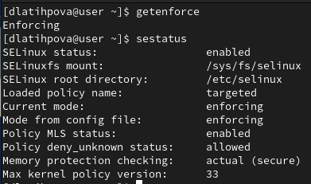{#fig:001 width=70%}

Обратилась с помощью браузера к веб-серверу, запущенному на моем компьютере, и убедилась, что последний работает(рис. [-@fig:002]):
```
service httpd status
```

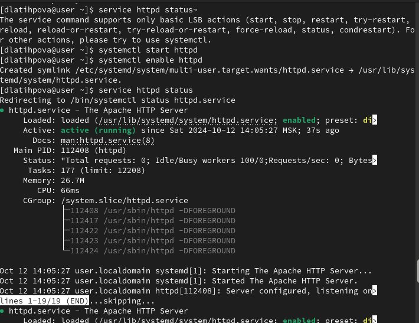{#fig:002 width=70%}

Нашла веб-сервер Apache в списке процессов, определила его контекст безопасности - httpd_t (рис. [-@fig:003]):
```
ps auxZ | grep httpd
```

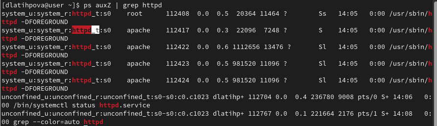{#fig:003 width=70%}

Посмотрела текущее состояние переключателей SELinux для Apache с
помощью команды:
```
sestatus -bigrep httpd
```
Многие из них находятся в положении «off» (рис. [-@fig:004]):

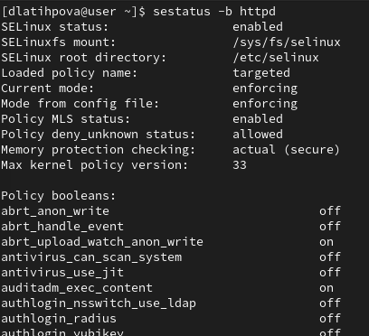{#fig:004 width=70%}

Посмотрела статистику по политике с помощью команды `seinfo`, также выделила множество пользователей, ролей, типов (рис. [-@fig:005]):

{#fig:005 width=70%}

Определила тип файлов и поддиректорий, находящихся в директории
/var/www, с помощью команды:
```
ls -lZ /var/www
```
Определила тип файлов, находящихся в директории /var/www/html:
```
ls -lZ /var/www/html
```
Определила круг пользователей, которым разрешено создание файлов в
директории /var/www/html - 0 (рис. [-@fig:006]):

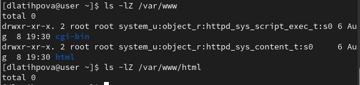{#fig:006 width=70%}

Создала от имени суперпользователя (так как в дистрибутиве после установки только ему разрешена запись в директорию) html-файл
/var/www/html/test.html следующего содержания (рис. [-@fig:008]):
```
<html>
<body>test</body>
</html>
```
Проверила контекст созданного мной файла (рис. [-@fig:007]):

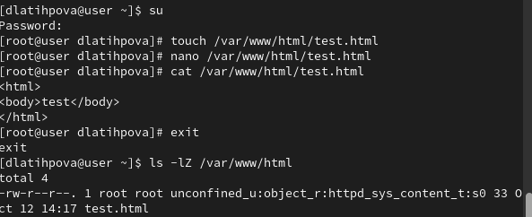{#fig:007 width=70%}

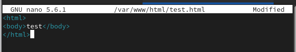{#fig:008 width=70%}

Обратилась к файлу через веб-сервер, введя в браузере адрес
http://127.0.0.1/test.html. Файл успешно отображён (рис. [-@fig:009]):

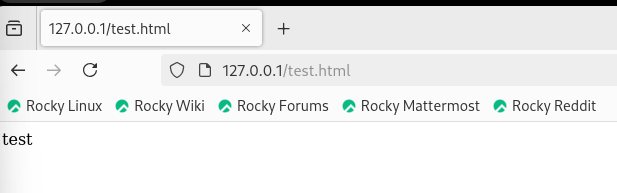{#fig:009 width=70%}

Изучила справку man httpd_selinux и выяснила, какие контексты файлов определены для httpd. Проверила контекст файла командой (рис. [-@fig:010]):
```
ls -Z /var/www/html/test.html
```

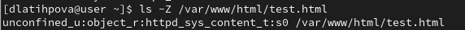{#fig:010 width=70%}

Изменила контекст файла /var/www/html/test.html с
httpd_sys_content_t на samba_share_t (рис. [-@fig:011]):
```
chcon -t samba_share_t /var/www/html/test.html
ls -Z /var/www/html/test.html
``` 

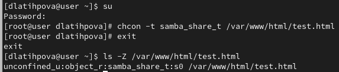{#fig:011 width=70%}

1Попробовала ещё раз получить доступ к файлу через веб-сервер, введя в
браузере адрес http://127.0.0.1/test.html. Вышла ошибка(рис. [-@fig:012]):
```
Forbidden
You don't have permission to access /test.html on this server.
```

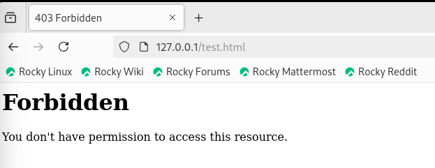{#fig:012 width=70%}

Просмотрела log-файлы веб-сервера Apache. Также просмотрела системный лог-файл(рис. [-@fig:013]):
```
tail /var/log/messages
```

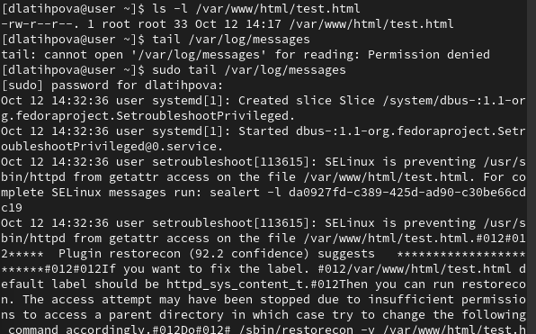{#fig:013 width=70%}

Попробовала запустить веб-сервер Apache на прослушивание ТСР-порта
81 (а не 80, как рекомендует IANA и прописано в /etc/services). Для
этого в файле /etc/httpd/httpd.conf Listen 80 заменила её на Listen 81 (рис. [-@fig:015]):

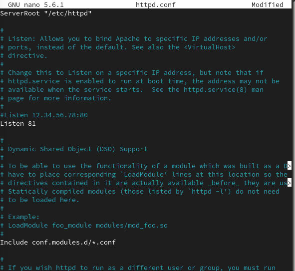{#fig:015 width=70%}

Выполнила перезапуск веб-сервера Apache (рис. [-@fig:014]):

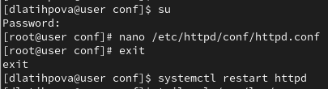{#fig:014 width=70%}

Проанализировла лог-файлы:
```
tail -n1 /var/log/messages
```
Просмотрела файлы /var/log/http/error_log,
/var/log/http/access_log и /var/log/audit/audit.log. В последнем появились записи (рис. [-@fig:016]):

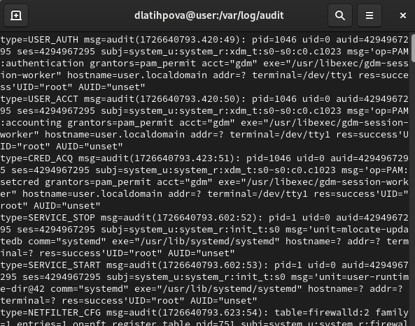{#fig:016 width=70%}

Выполнила команду:
```
semanage port -a -t http_port_t -р tcp 81
```
После этого проверила список портов командой:
```
semanage port -l | grep http_port_t
```
Порт 81 появился в списке. Попробовала запустить веб-сервер Apache ещё раз (рис. [-@fig:017]):

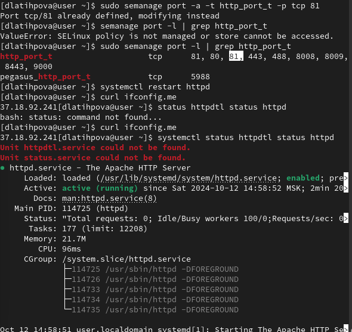{#fig:017 width=70%}

Вернула контекст httpd_sys_cоntent__t к файлу /var/www/html/ test.html:
```
chcon -t httpd_sys_content_t /var/www/html/test.html
```
После этого попробовала получить доступ к файлу через веб-сервер, введя в браузере адрес http://127.0.0.1:81/test.html (рис. [-@fig:018]):

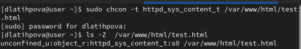{#fig:018 width=70%}

Увидела содержимое файла — слово «test» (рис. [-@fig:019]):

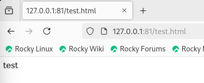{#fig:019 width=70%}

Исправила обратно конфигурационный файл apache, вернув Listen 80 (рис. [-@fig:020]):

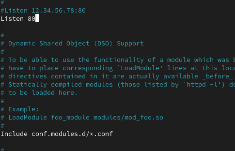{#fig:020 width=70%}

Удалила привязку http_port_t к 81 порту:
```
semanage port -d -t http_port_t -p tcp 81
```
и проверила, что порт 81 удалён (рис. [-@fig:021]):

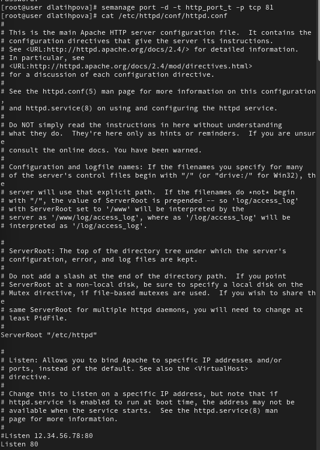{#fig:021 width=70%}

Удалила файл /var/www/html/test.html (рис. [-@fig:022]):
```
rm /var/www/html/test.html
```

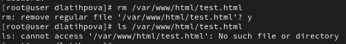{#fig:022 width=70%}


# Выводы

Я развила навыки администрирования ОС Linux и получила первое практическое знакомство с технологией SELinux. А также проверила работу SELinx на практике совместно с веб-сервером Apache.

# Список литературы{.unnumbered}

::: {#refs}
:::
