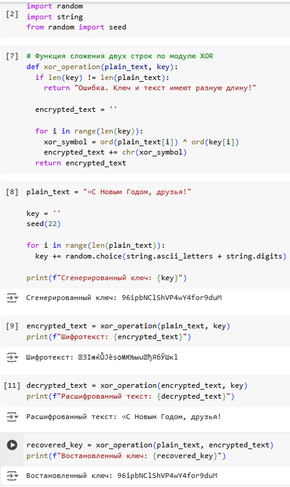

---
## Front matter
lang: ru-RU
title: Лабораторная работа №7
subtitle: Элементы криптографии. Однократное гаммирование
author:
  - Латыпова Диана
institute:
  - Российский университет дружбы народов, Москва, Россия
date: 19 октября 2024

## i18n babel
babel-lang: russian
babel-otherlangs: english

## Formatting pdf
toc: false
toc-title: Содержание
slide_level: 2
aspectratio: 169
section-titles: true
theme: metropolis
header-includes:
 - \metroset{progressbar=frametitle,sectionpage=progressbar,numbering=fraction}
---

# Информация

## Докладчик

:::::::::::::: {.columns align=center}
::: {.column width="70%"}

  * Латыпова Диана
  * студент группы НФИбд-02-21
  * Российский университет дружбы народов
  * [1032215005@rudn.ru](mailto:1032215005@rudn.ru)
  * <https://github.com/dlatypova>

:::
::: {.column width="30%"}

:::
::::::::::::::

# Вводная часть

## Цели и задачи

- Освоить на практике применение режима однократного гаммирования

# Теоретическое ввведение

## Шифрование/Дешифрование

- **Шифрование** — это процесс преобразования информации (открытого текста) в форму, недоступную для несанкционированного доступа, называемую шифротекстом. 
- **Дешифрование** является обратным процессом, при котором шифротекст преобразуется обратно в открытый текст.

## Однократное гаммирование

- Основано на применении ключа, длина которого совпадает с длиной исходного текста. 
- Символ, подвергнутый XOR с ключом, превращается в шифротекст
- Шифротекст, подвергнутый той же операции XOR с тем же ключом, восстанавливает исходный текст

Восстановление исходного текста: $T = C \oplus K$.

## Преимущества и недостатки однократного гаммирования

*Преимущества:*

- Абсолютная криптографическая стойкость
- Простота реализации

*Недостатки:*

- Длина ключа
- Одноразовость ключа
- Генерация случайного ключа
- Управление ключами

## Операция XOR

- Представляет собой побитовую операцию над двумя строками символов
- Каждый бит открытого текста складывается с соответствующим битом ключа
- Результат операции — это новый набор битов, представляющий шифротекст.

## Алгоритм однократного гаммирования:

1. Генерация ключа
2. Шифрование
3. Дешифрование

# Выполнение лабораторной работы

## Код с результатами

{#fig:001 width=30%}

# Выводы

## Выводы

- Освоено на практике применение режима однократного гаммирования