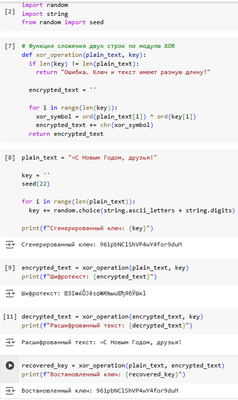

---
## Front matter
title: "Лабораторная работа №7"
subtitle: "Элементы криптографии. Однократное гаммирование"
author: "Латыпова Диана. НФИбд-02-21"

## Generic otions
lang: ru-RU
toc-title: "Содержание"

## Bibliography
bibliography: bib/cite.bib
csl: pandoc/csl/gost-r-7-0-5-2008-numeric.csl

## Pdf output format
toc: true # Table of contents
toc-depth: 2
lof: true # List of figures
lot: true # List of tables
fontsize: 12pt
linestretch: 1.5
papersize: a4
documentclass: scrreprt
## I18n polyglossia
polyglossia-lang:
  name: russian
  options:
	- spelling=modern
	- babelshorthands=true
polyglossia-otherlangs:
  name: english
## I18n babel
babel-lang: russian
babel-otherlangs: english
## Fonts
mainfont: IBM Plex Serif
romanfont: IBM Plex Serif
sansfont: IBM Plex Sans
monofont: IBM Plex Mono
mathfont: STIX Two Math
mainfontoptions: Ligatures=Common,Ligatures=TeX,Scale=0.94
romanfontoptions: Ligatures=Common,Ligatures=TeX,Scale=0.94
sansfontoptions: Ligatures=Common,Ligatures=TeX,Scale=MatchLowercase,Scale=0.94
monofontoptions: Scale=MatchLowercase,Scale=0.94,FakeStretch=0.9
mathfontoptions:
## Biblatex
biblatex: true
biblio-style: "gost-numeric"
biblatexoptions:
  - parentracker=true
  - backend=biber
  - hyperref=auto
  - language=auto
  - autolang=other*
  - citestyle=gost-numeric
## Pandoc-crossref LaTeX customization
figureTitle: "Рис."
tableTitle: "Таблица"
listingTitle: "Листинг"
lofTitle: "Список иллюстраций"
lotTitle: "Список таблиц"
lolTitle: "Листинги"
## Misc options
indent: true
header-includes:
  - \usepackage{indentfirst}
  - \usepackage{float} # keep figures where there are in the text
  - \floatplacement{figure}{H} # keep figures where there are in the text
---

# Цель работы

Освоить на практике применение режима однократного гаммирования.

# Задание

Нужно подобрать ключ, чтобы получить сообщение «С Новым Годом,
друзья!». Требуется разработать приложение, позволяющее шифровать и
дешифровать данные в режиме однократного гаммирования. Приложение
должно:

1. Определить вид шифротекста при известном ключе и известном открытом тексте.
2. Определить ключ, с помощью которого шифротекст может быть преобразован в некоторый фрагмент текста, представляющий собой один из
возможных вариантов прочтения открытого текста.

# Теоретическое введение

## Шифрование

**Шифрование** — это процесс преобразования информации (открытого текста) в форму, недоступную для несанкционированного доступа, называемую шифротекстом. Дешифрование, в свою очередь, является обратным процессом, при котором шифротекст преобразуется обратно в открытый текст [@wiki:bash].

Одной из наиболее безопасных и теоретически стойких к атакам техник шифрования является однократное гаммирование или одноразовый блокнот (англ. One-Time Pad). Эта техника обеспечивает абсолютную криптографическую стойкость при условии правильного применения.

## Однократное гаммирование

**Однократное гаммирование** основано на применении ключа, длина которого совпадает с длиной исходного текста. При этом ключ должен использоваться только один раз и быть абсолютно случайным [@gamma:bash].

Основной принцип шифрования заключается в применении операции исключающего ИЛИ (XOR) над символами открытого текста и символами ключа. Операция XOR обладает следующими важными свойствами:

- Символ, подвергнутый XOR с ключом, превращается в шифротекст.
- Шифротекст, подвергнутый той же операции XOR с тем же ключом, восстанавливает исходный текст.
Формально это можно записать следующим образом:

Пусть $T$ — символ открытого текста, $K$ — символ ключа, тогда шифротекст $C$ будет равен $C = T \oplus K$.
Для восстановления исходного текста: $T = C \oplus K$.

**Преимущества и недостатки однократного гаммирования**

*Преимущества:*

- Абсолютная криптографическая стойкость — при условии, что ключ случайный, используется только один раз и не становится известным третьей стороне, шифрование с использованием одноразового блокнота невозможно взломать с использованием современных вычислительных методов
- Простота реализации — процесс шифрования и дешифрования основан на простой операции XOR, которая легко реализуема программно.

*Недостатки:*

- Длина ключа — длина ключа должна быть равна длине шифруемого сообщения, что делает процесс генерации, хранения и передачи ключей сложным
- Одноразовость ключа — ключ должен использоваться только один раз. Повторное использование ключа делает систему уязвимой к криптоанализу.

## Операция XOR

**Операция исключающего ИЛИ (XOR)** представляет собой побитовую операцию над двумя строками символов. Каждый бит открытого текста складывается с соответствующим битом ключа. Результат операции — это новый набор битов, представляющий шифротекст [@xor:bash].

*Пример выполнения операции XOR:*

Открытый текст: 01010100 (ASCII-код символа "T")

Ключ: 11001010

Шифротекст: 10011110

Операция XOR выполняется над каждой парой битов:
```
0 ⊕ 1 = 1
1 ⊕ 1 = 0
0 ⊕ 0 = 0
1 ⊕ 0 = 1
0 ⊕ 1 = 1
1 ⊕ 0 = 1
0 ⊕ 1 = 1
0 ⊕ 0 = 0
```
Результат: 10011110

**Алгоритм** однократного гаммирования включает следующие основные шаги:

1. Генерация ключа: Ключ генерируется случайным образом и должен быть равен по длине открытым данным.
2. Шифрование: Открытый текст и ключ комбинируются с использованием операции XOR, результатом чего является шифротекст.
3. Дешифрование: Для дешифрования шифротекста используется тот же ключ и операция XOR, что восстанавливает исходный текст.

# Выполнение лабораторной работы

Написанный код с комментариями (рис. [-@fig:001]):

```
import random
from random import seed
import string

# Функция для сложения двух строк по модулю XOR
def xor_operation(plain_text, key):
    # Проверка, чтобы длина ключа и текста совпадали
    if len(key) != len(plain_text): 
        return "Ошибка: Ключ и текст разной длины"
    
    encrypted_text = ''
    # Поочередное применение XOR для символов текста и ключа
    for i in range(len(key)):
        xor_symbol = ord(plain_text[i]) ^ ord(key[i])  # Применение XOR
        encrypted_text += chr(xor_symbol)  # Преобразование в символ
    return encrypted_text

# Ввод исходного открытого текста
plain_text = "С Новым Годом, друзья!"

# Генерация случайного ключа такой же длины, как текст
key = ''
seed(22)  # Фиксация случайного числа для воспроизводимости
for i in range(len(plain_text)):
    key += random.choice(string.ascii_letters + string.digits)  # Выбор случайных символов
print(f"Сгенерированный ключ: {key}")

# Шифрование текста с помощью функции XOR
encrypted_text = xor_operation(plain_text, key)
print(f"Шифротекст: {encrypted_text}")

# Дешифрование (получение исходного текста) с использованием того же ключа
decrypted_text = xor_operation(encrypted_text, key)
print(f"Расшифрованный текст: {decrypted_text}")

# Получение ключа при известном шифротексте и открытом тексте
recovered_key = xor_operation(plain_text, encrypted_text)
print(f"Восстановленный ключ: {recovered_key}")

```

{#fig:001 width=70%}

# Контрольные вопросы

1. Поясните смысл однократного гаммирования.

**Однократное гаммирование (One-Time Pad)** — это метод шифрования, который использует случайный ключ длиной, равной длине сообщения. Ключ применяется только один раз для шифрования и дешифрования данных. Для каждого символа открытого текста применяется операция XOR с соответствующим символом ключа, что превращает текст в шифротекст. Этот метод является абсолютно стойким к взлому, если соблюдены определенные условия: ключ абсолютно случайный, используется один раз и не известен третьим лицам.

2. Перечислите недостатки однократного гаммирования.

- *Длина ключа.* Ключ должен быть такой же длины, как и сообщение, что усложняет его хранение и передачу
- *Одноразовость ключа.* Ключ можно использовать только один раз для одного сообщения. Повторное использование делает систему уязвимой
- *Генерация случайного ключа.* Ключ должен быть абсолютно случайным, что трудно обеспечить на практике
- *Управление ключами.* Сложность в безопасной передаче ключа от отправителя к получателю без риска компрометации.

3. Перечислите преимущества однократного гаммирования.

- *Абсолютная стойкость.* При правильном использовании система не подвержена криптоанализу, что делает её одной из самых безопасных
- *Простота реализации.* Алгоритм шифрования и дешифрования очень прост и основан на базовой операции XOR.

4. Почему длина открытого текста должна совпадать с длиной ключа?

Длина ключа должна совпадать с длиной открытого текста, потому что каждому символу текста должен соответствовать уникальный символ ключа. Это необходимо для обеспечения абсолютной безопасности шифра. Если длина ключа меньше длины текста, не получится зашифровать всё сообщение, а если ключ длиннее, часть ключа останется неиспользованной, что делает его неполным.

5. Какая операция используется в режиме однократного гаммирования, назовите её особенности?

В режиме однократного гаммирования используется операция исключающего ИЛИ (XOR). Особенности этой операции:

- Она симметрична: 
$A⊕B=B⊕A$
- Она обратима: 
$если C=A⊕B, то A=C⊕B$
- Применение операции XOR с тем же ключом восстанавливает исходный текст.

6. Как по открытому тексту и ключу получить шифротекст?

Чтобы получить шифротекст, каждый символ открытого текста нужно побитово сложить с соответствующим символом ключа с использованием операции XOR. Формула выглядит так: 
$C=T⊕K$ где

$T$ — это символ открытого текста, 

$K$ — соответствующий символ ключа, 

$C$ — результат (шифротекст).

7. Как по открытому тексту и шифротексту получить ключ?

Чтобы восстановить ключ, нужно применить операцию XOR между символами открытого текста и шифротекста: 
$K=T⊕C$ где 

$T$ — символ открытого текста, 

$C$ — соответствующий символ шифротекста,

$K$ — результат (ключ).

8. В чем заключаются необходимые и достаточные условия абсолютной стойкости шифра?

Для абсолютной стойкости шифра необходимо соблюдение следующих условий:

- *Случайность ключа.* Ключ должен быть абсолютно случайным и непредсказуемым
- *Равенство длины ключа и текста.* Длина ключа должна совпадать с длиной открытого текста
- *Одноразовость ключа.* Ключ должен использоваться только один раз. Повторное использование ключа значительно снижает безопасность.
- *Секретность ключа.* Ключ должен быть известен только отправителю и получателю. Любая утечка ключа делает шифр уязвимым.

Если все эти условия выполнены, однократное гаммирование обеспечивает абсолютную криптографическую стойкость.

# Выводы

Я освоила на практике применение режима однократного гаммирования.

# Список литературы{.unnumbered}

::: {#refs}
:::
