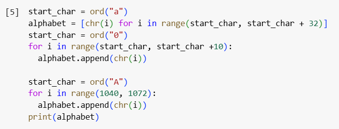
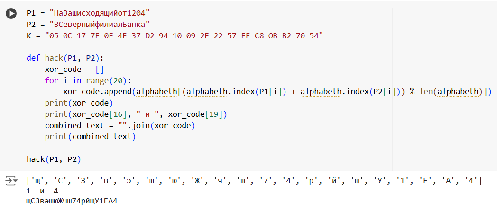
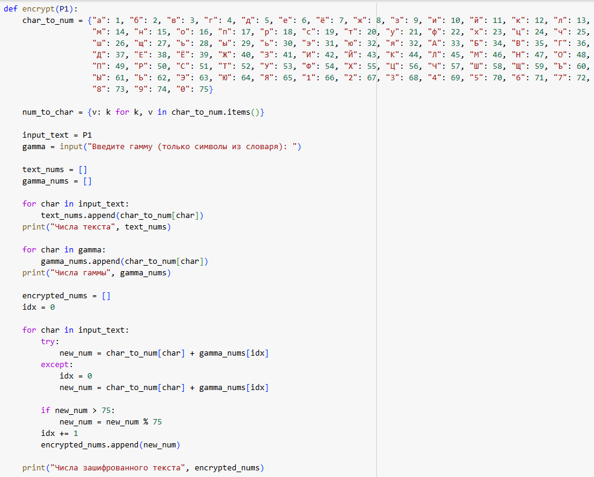
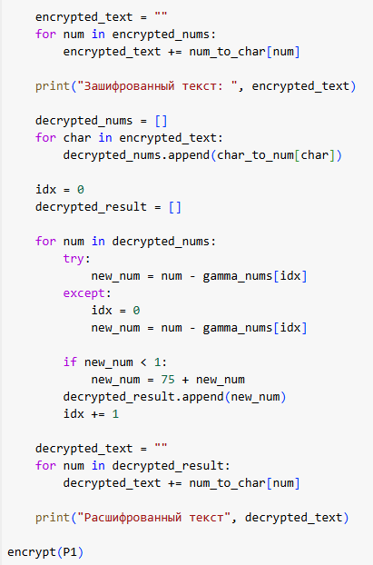
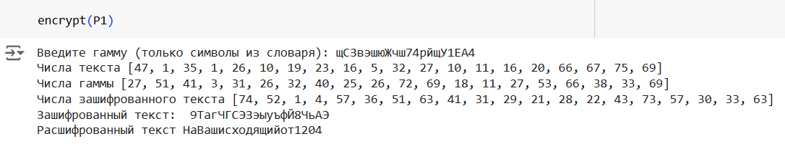

---
## Front matter
lang: ru-RU
title: Лабораторная работа №8
subtitle: Элементы криптографии. Шифрование (кодирование) различных исходных текстов одним ключом
author:
  - Латыпова Диана
institute:
  - Российский университет дружбы народов, Москва, Россия
date: 24 октября 2024

## i18n babel
babel-lang: russian
babel-otherlangs: english

## Formatting pdf
toc: false
toc-title: Содержание
slide_level: 2
aspectratio: 169
section-titles: true
theme: metropolis
header-includes:
 - \metroset{progressbar=frametitle,sectionpage=progressbar,numbering=fraction}
---

# Информация

## Докладчик

:::::::::::::: {.columns align=center}
::: {.column width="70%"}

  * Латыпова Диана
  * студент группы НФИбд-02-21
  * Российский университет дружбы народов
  * [1032215005@rudn.ru](mailto:1032215005@rudn.ru)
  * <https://github.com/dlatypova>

:::
::: {.column width="30%"}

:::
::::::::::::::

# Вводная часть

## Цели и задачи

- Освоение на практике применения режима однократного гаммирования на примере кодирования различных исходных текстов одним ключом

# Теоретическое введенние

## Однократное гаммирование

- метод шифрования, при котором каждый бит открытого текста комбинируется с битом ключа с помощью операции *исключающего ИЛИ* (XOR).

\[ C = P \oplus K \]

где:
- \( C \) — шифртекст,
- \( P \) — открытый текст,
- \( K \) — ключ.

## Преимущества

- **Идеальная стойкость**
- **Простота реализации**
- **Гибкость**

## Недостатки:

- **Проблемы с управлением ключами**
- **Уязвимость к атаке при повторном использовании ключа**
- **Необходимость в хранении ключей**

# Задание

Два текста кодируются одним ключом (однократное гаммирование).
Требуется не зная ключа и не стремясь его определить, прочитать оба текста. Необходимо разработать приложение, позволяющее шифровать и дешифровать тексты $P1$ и $P2$ в режиме однократного гаммирования. Приложение должно определить вид шифротекстов $C1$ и $C2$ обоих текстов $P1$ и
$P2$ при известном ключе ; Необходимо определить и выразить аналитически способ, при котором злоумышленник может прочитать оба текста, не
зная ключа и не стремясь его определить.

# Выполнение лабораторной работы

## Код (1)

{#fig:001 width=50%}

## Код (2)

{#fig:002 width=50%}

## Код (3)

{#fig:003 width=40%}

## Код (4)

{#fig:004 width=40%}

## Код (2)

{#fig:002 width=50%}

# Выводы

## Выводы

- Освоено на практике применение режима однократного гаммирования на примере кодирования различных исходных текстов одним ключом