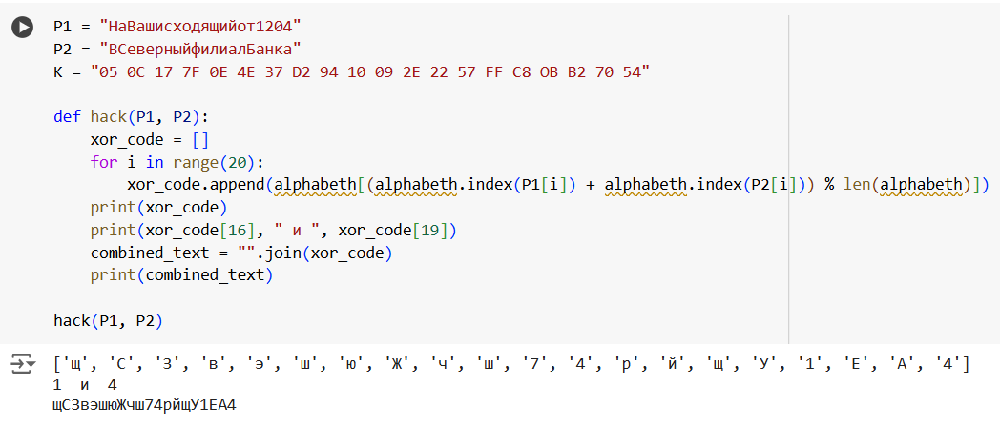
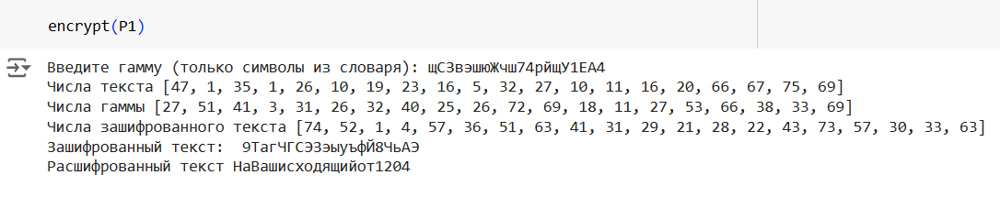

---
## Front matter
title: "Лабораторная работа №8"
subtitle: "Элементы криптографии. Шифрование (кодирование) различных исходных текстов одним ключом"
author: "Латыпова Диана"

## Generic otions
lang: ru-RU
toc-title: "Содержание"

## Bibliography
bibliography: bib/cite.bib
csl: pandoc/csl/gost-r-7-0-5-2008-numeric.csl

## Pdf output format
toc: true # Table of contents
toc-depth: 2
lof: true # List of figures
lot: true # List of tables
fontsize: 12pt
linestretch: 1.5
papersize: a4
documentclass: scrreprt
## I18n polyglossia
polyglossia-lang:
  name: russian
  options:
	- spelling=modern
	- babelshorthands=true
polyglossia-otherlangs:
  name: english
## I18n babel
babel-lang: russian
babel-otherlangs: english
## Fonts
mainfont: IBM Plex Serif
romanfont: IBM Plex Serif
sansfont: IBM Plex Sans
monofont: IBM Plex Mono
mathfont: STIX Two Math
mainfontoptions: Ligatures=Common,Ligatures=TeX,Scale=0.94
romanfontoptions: Ligatures=Common,Ligatures=TeX,Scale=0.94
sansfontoptions: Ligatures=Common,Ligatures=TeX,Scale=MatchLowercase,Scale=0.94
monofontoptions: Scale=MatchLowercase,Scale=0.94,FakeStretch=0.9
mathfontoptions:
## Biblatex
biblatex: true
biblio-style: "gost-numeric"
biblatexoptions:
  - parentracker=true
  - backend=biber
  - hyperref=auto
  - language=auto
  - autolang=other*
  - citestyle=gost-numeric
## Pandoc-crossref LaTeX customization
figureTitle: "Рис."
tableTitle: "Таблица"
listingTitle: "Листинг"
lofTitle: "Список иллюстраций"
lotTitle: "Список таблиц"
lolTitle: "Листинги"
## Misc options
indent: true
header-includes:
  - \usepackage{indentfirst}
  - \usepackage{float} # keep figures where there are in the text
  - \floatplacement{figure}{H} # keep figures where there are in the text
---

# Цель работы

Освоить на практике применение режима однократного гаммирования на примере кодирования различных исходных текстов одним ключом.

# Задание

Два текста кодируются одним ключом (однократное гаммирование).
Требуется не зная ключа и не стремясь его определить, прочитать оба текста. Необходимо разработать приложение, позволяющее шифровать и дешифровать тексты $P1$ и $P2$ в режиме однократного гаммирования. Приложение должно определить вид шифротекстов $C1$ и $C2$ обоих текстов $P1$ и
$P2$ при известном ключе ; Необходимо определить и выразить аналитически способ, при котором злоумышленник может прочитать оба текста, не
зная ключа и не стремясь его определить.

# Теоретическое введение

## Введение в шифрование

Шифрование является важной частью информационной безопасности, обеспечивая конфиденциальность данных путем их преобразования в неразборчивый вид. Одним из наиболее простых и при этом эффективных методов шифрования является **однократное гаммирование** (или шифрование с использованием одноразового блокнота), которое обеспечивает идеальную стойкость при правильном использовании[@c:bash].

## Основы однократного гаммирования

**Однократное гаммирование** — это метод шифрования, при котором каждый бит открытого текста комбинируется с битом ключа [@gamma:bash] с помощью операции *исключающего ИЛИ* (XOR) [@xor:bash]. Этот метод основан на следующей формуле:

\[ C = P \oplus K \]

где:
- \( C \) — шифртекст,
- \( P \) — открытый текст,
- \( K \) — ключ.

Ключ должен быть случайным, иметь ту же длину, что и открытый текст, и использоваться только один раз. Это условие обеспечивает идеальную стойкость метода: даже если злоумышленник получит доступ к шифртексту, он не сможет восстановить открытый текст без знания ключа.

## Преимущества и недостатки

### Преимущества:

- **Идеальная стойкость**: Однократное гаммирование предоставляет идеальную стойкость, если ключ является случайным и не используется повторно.
- **Простота реализации**: Метод легко реализуется, так как XOR является простой и быстрой операцией.
- **Гибкость**: Однократное гаммирование может использоваться для шифрования данных любой длины, при условии, что ключ такой же длины.

### Недостатки:

- **Проблемы с управлением ключами**: Для каждого нового сообщения требуется уникальный ключ, что может усложнить процесс хранения и передачи ключей.
- **Уязвимость к атаке при повторном использовании ключа**: Если один и тот же ключ используется для шифрования нескольких сообщений, это может раскрыть информацию о открытых текстах.
- **Необходимость в хранении ключей**: Долговременное хранение и безопасная передача ключей могут представлять собой сложность.

# Выполнение лабораторной работы

Первая часть кода:
```
# Создаем алфавит из русских букв и цифр для гаммирования
start_char = ord("а")
alphabeth = [chr(i) for i in range(start_char, start_char + 32)]  # Добавляем строчные буквы русского алфавита (32 буквы)
start_char = ord("0")
for i in range(start_char, start_char + 10):
    alphabeth.append(chr(i))  # Добавляем цифры (0-9)

start_char = ord("А")
for i in range(1040, 1072):
    alphabeth.append(chr(i))  # Добавляем заглавные буквы русского алфавита (32 буквы)
print(alphabeth)

# Измененные тексты для шифрования
P1 = "НаВашисходящийот1204"
P2 = "ВСеверныйфилиалБанка"

# Задан ключ длиной 20 символов для гаммирования
K = "05 0C 17 7F 0E 4E 37 D2 94 10 09 2E 22 57 FF C8 0B B2 70 54"

# Функция взлома, которая ищет закономерности между двумя зашифрованными текстами P1 и P2
def hack(P1, P2):
    xor_code = []
    # Для каждого символа выполняется сложение индексов символов из двух текстов
    for i in range(20):
        xor_code.append(alphabeth[(alphabeth.index(P1[i]) + alphabeth.index(P2[i])) % len(alphabeth)])
    # Выводим результат сложения символов для визуального анализа
    print(xor_code)
    print(xor_code[16], " и ", xor_code[19])  # Показываем определенные символы для анализа
    combined_text = "".join(xor_code)  # Собираем итоговый текст из символов
    print(combined_text)

hack(P1, P2)  # Вызываем функцию для взлома
```

Вызвали функцию hack(рис. [-@fig:001]).

{#fig:001 width=70%}

Код для шифрования и расшифрования текста:
```
# Функция для шифрования и дешифрования текста с использованием метода однократного гаммирования
def encrypt(P1):
    # Создаем словарь, который связывает символы русского алфавита и цифры с числами
    char_to_num = {"а": 1, "б": 2, "в": 3, "г": 4, "д": 5, "е": 6, "ё": 7, "ж": 8, "з": 9, "и": 10, "й": 11, "к": 12, "л": 13,
                   "м": 14, "н": 15, "о": 16, "п": 17, "р": 18, "с": 19, "т": 20, "у": 21, "ф": 22, "х": 23, "ц": 24, "ч": 25, 
                   "ш": 26, "щ": 27, "ъ": 28, "ы": 29, "ь": 30, "э": 31, "ю": 32, "я": 32, "А": 33, "Б": 34, "В": 35, "Г": 36, 
                   "Д": 37, "Е": 38, "Ё": 39, "Ж": 40, "З": 41, "И": 42, "Й": 43, "К": 44, "Л": 45, "М": 46, "Н": 47, "О": 48, 
                   "П": 49, "Р": 50, "С": 51, "Т": 52, "У": 53, "Ф": 54, "Х": 55, "Ц": 56, "Ч": 57, "Ш": 58, "Щ": 59, "Ъ": 60, 
                   "Ы": 61, "Ь": 62, "Э": 63, "Ю": 64, "Я": 65, "1": 66, "2": 67, "3": 68, "4": 69, "5": 70, "6": 71, "7": 72, 
                   "8": 73, "9": 74, "0": 75}

    # Создаем обратный словарь для декодирования чисел в символы
    num_to_char = {v: k for k, v in char_to_num.items()}

    input_text = P1  # Входной текст
    gamma = input("Введите гамму (только символы из словаря): ")  # Запрашиваем у пользователя гамму

    text_nums = []
    gamma_nums = []

    # Преобразуем текст и гамму в числовые значения
    for char in input_text:
        text_nums.append(char_to_num[char])
    print("Числа текста", text_nums)  # Показываем числовое представление текста

    for char in gamma:
        gamma_nums.append(char_to_num[char])
    print("Числа гаммы", gamma_nums)  # Показываем числовое представление гаммы

    encrypted_nums = []
    idx = 0

    # Шифрование текста путем сложения чисел текста и гаммы
    for char in input_text:
        try:
            new_num = char_to_num[char] + gamma_nums[idx]  # Сложение числа символа текста и гаммы
        except:
            idx = 0  # Если индекс гаммы выходит за пределы, обнуляем его
            new_num = char_to_num[char] + gamma_nums[idx]

        if new_num > 75:  # Если число больше 75 (максимальный индекс), делаем модуль по 75
            new_num = new_num % 75
        idx += 1
        encrypted_nums.append(new_num)  # Добавляем зашифрованное число в список

    print("Числа зашифрованного текста", encrypted_nums)

    encrypted_text = ""
    for num in encrypted_nums:
        encrypted_text += num_to_char[num]  # Преобразуем зашифрованные числа обратно в текст

    print("Зашифрованный текст: ", encrypted_text)

    # Расшифровка текста
    decrypted_nums = []
    for char in encrypted_text:
        decrypted_nums.append(char_to_num[char])

    idx = 0
    decrypted_result = []

    # Дешифрование текста путем вычитания чисел гаммы из чисел зашифрованного текста
    for num in decrypted_nums:
        try:
            new_num = num - gamma_nums[idx]  # Вычитаем значение гаммы
        except:
            idx = 0
            new_num = num - gamma_nums[idx]

        if new_num < 1:  # Если число меньше 1, добавляем 75
            new_num = 75 + new_num
        decrypted_result.append(new_num)
        idx += 1

    decrypted_text = ""
    for num in decrypted_result:
        decrypted_text += num_to_char[num]  # Преобразуем числа обратно в текст

    print("Расшифрованный текст", decrypted_text)  # Выводим расшифрованный текст

encrypt(P1)  # Шифруем и расшифровываем текст
```

Выполнение кода(рис. [-@fig:002]).

{#fig:002 width=70%}

# Контрольные вопросы

### 1. Как, зная один из текстов (P1 или P2), определить другой, не зная при этом ключа?

Зная один из текстов (например, \( P1 \)) и используя тот факт, что шифрование выполняется с помощью операции XOR (как это происходит в однократном гаммировании), можно вычислить другой текст \( P2 \) следующим образом:
- Если известен шифртекст \( C \) и один из открытых текстов \( P1 \), то другой открытый текст можно восстановить с помощью обратного применения XOR: \( P2 = P1 \oplus C \), где \( \oplus \) — операция побитового исключающего ИЛИ (XOR).

Пример:
- Если \( C = P1 \oplus K \), а \( P2 = P1 \oplus K \), то зная \( P1 \), можно вычислить \( P2 \) с помощью операции \( P2 = P1 \oplus C \), где \( K \) — ключ.

### 2. Что будет при повторном использовании ключа при шифровании текста?

Повторное использование ключа в шифровании однократным гаммированием (одноразовым блокнотом) приводит к серьезным криптографическим уязвимостям:
- Если два текста \( P1 \) и \( P2 \) зашифрованы одним и тем же ключом \( K \), то разность их шифртекстов может дать разность исходных текстов: \( C1 \oplus C2 = P1 \oplus P2 \).
- Это позволяет криптоаналитику вычислить некоторые характеристики исходных текстов (или даже восстановить их полностью), что делает шифрование уязвимым к атакам, таким как атака известной разности текстов.

### 3. Как реализуется режим шифрования однократного гаммирования одним ключом двух открытых текстов?

Режим шифрования однократного гаммирования двумя открытыми текстами реализуется следующим образом:
1. Генерируется случайный ключ длиной, равной длине каждого из текстов \( P1 \) и \( P2 \).
2. Оба текста шифруются с использованием ключа по правилу:
   - \( C1 = P1 \oplus K \)
   - \( C2 = P2 \oplus K \)
3. Шифртексты \( C1 \) и \( C2 \) передаются или хранятся вместе с ключом для дальнейшей расшифровки.

### 4. Перечислите недостатки шифрования одним ключом двух открытых текстов.

- **Повторное использование ключа**: Как уже упоминалось, если один и тот же ключ используется для шифрования двух разных сообщений, можно вычислить разность между открытыми текстами, что может привести к раскрытию оригинальных текстов.
- **Уязвимость к атаке известной разности текстов**: Повторное использование ключа может раскрыть информацию об исходных данных, что существенно снижает стойкость шифра.
- **Проблемы с управлением ключами**: Для каждого нового сеанса шифрования требуется новый уникальный ключ, который нужно безопасно передавать и хранить. Если ключ повторно используется или его длина меньше длины сообщения, шифр теряет свою идеальную стойкость.

### 5. Перечислите преимущества шифрования одним ключом двух открытых текстов.

- **Простота реализации**: Процедура однократного гаммирования очень проста в реализации, так как использует операцию XOR, которая быстро выполняется.
- **Идеальная стойкость при соблюдении условий**: Однократное гаммирование является абсолютно стойким методом шифрования (невозможно вскрыть зашифрованный текст без знания ключа) при условии, что ключ используется только один раз и имеет ту же длину, что и исходный текст.
- **Отсутствие зависимости от длины текста**: Метод может применяться к сообщениям любой длины при наличии ключа той же длины, что делает его универсальным для различной информации.

Недостатки метода, связанные с ключевым управлением и повторным использованием ключей, обычно перевешивают эти преимущества, что ограничивает его использование в практических сценариях.

# Выводы

Я освоила на практике применение режима однократного гаммирования на примере кодирования различных исходных текстов одним ключом.

# Список литературы{.unnumbered}

::: {#refs}
:::
