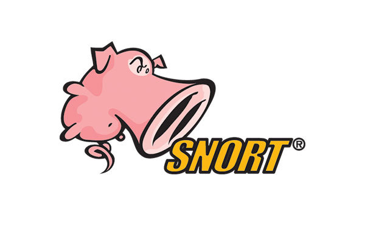

---
## Front matter
lang: ru-RU
title: Доклад
subtitle: Система обнаружения атак Snort
author:
  - Латыпова Диана
institute:
  - Российский университет дружбы народов имени Патриса Лумумбы, Москва, Россия
date: 01 января 1970

## i18n babel
babel-lang: russian
babel-otherlangs: english

## Formatting pdf
toc: false
toc-title: Содержание
slide_level: 2
aspectratio: 169
section-titles: true
theme: metropolis
header-includes:
 - \metroset{progressbar=frametitle,sectionpage=progressbar,numbering=fraction}
---

# Информация

## Докладчик

:::::::::::::: {.columns align=center}
::: {.column width="70%"}

  * Латыпова Диана
  * студент НФИбд-02-21
  * Российский университет дружбы народов имени Патриса Лумумбы
  * [1032215005@rudn.ru](mailto:1032215005@rudn.ru)
  * <https://github.com/dlatypova>

:::
::: {.column width="30%"}

:::
::::::::::::::

# Вводная часть

## Проблема

С увеличением количества кибератак и угроз, направленных на взлом сетей и систем, возрастает необходимость в эффективных инструментах обнаружения и предотвращения вторжений. Одним из решений данной проблемы является использование систем обнаружения вторжений (IDS), таких как Snort.

## Цели и задачи

- Изучение системы обнаружения вторжений Snort, её возможностей и принципов функционирования
- Рассмотрение архитектуры Snort, принципов работы с правилами и сигнатурами атак 
- Выявление преимуществ и недостатков использования Snort.

# Теоретическая часть

## Что такое Snort?

- Открытая система обнаружения вторжений, разработанная для анализа сетевого трафика в режиме реального времени
- Разработана компанией Sourcefire в 1998 году
- Использует сигнатуры (правила) для выявления известных угроз

{#fig:001 width=30%}

## Режимы Snort

- **Сниффер (Sniffer Mode).** (перехват и отображение сетевого трафика)

- **Регистратор пакетов (Packet Logger Mode).** (запись всего трафика на жесткий диск для последующего анализа)

- **Система обнаружения вторжений  (IDS Mode).** (анализ трафика на предмет соответствия заранее заданным правилам и сигнатурам атак)

## Архитектура Snort

{#fig:002 width=60%}

## Правила и сигнатуры

Правила nort могут определять:

- IP-адреса источника и назначения,
- используемые порты,
- протоколы,
- ключевые строки и шаблоны, содержащиеся в данных пакетов.

**Типы** правил:

1. Правила обнаружения
2. Правила блокировки
3. Правила уведомления

## Установка и настройка Snort

1. Установка ПО Snort
2. Настройка конфигурационного файла snort.conf
3. Загрузка/создание правил для обнаружения конкретных угроз
4. Запуск Snort в одном из режимов

## Преимущества и недостатки Snort

|Преимущества| |Недостатки|
|-|-|-|
|ПО с открытым исходным кодом| |Высокая нагрузка на ресурсы|
|регулярное обновление базы правил для защиты от новых угроз| |Необходимость в регулярных обновлениях|
|Широкие возможности| |Чувствительность к обходу правил|
|Поддержка множества протоколов| |Ложные срабатывания|
|Интеграция с другими системами| ||

## Применение Snort

- Обнаружения вторжений
- Сбора данных для последующего анализа
- Создания правил блокировки

# Выводы

- Snort - мощная и гибкая система обнаружения вторжений
- Благодаря открытости и активной поддержке сообщества, Snort остается одним из лидеров среди IDS

## Ресурсы

1. Snort [Электронный ресурс]. Википе́дия (англ. Wikipedia), 2024. URL: https:
//ru.wikipedia.org/wiki/Snort.
2. Система обнаружения вторжения Snort [Электронный ресурс]. vc.ru, Салим-
жанов Р.Д, 2024. URL: https://vc.ru/dev/1330525-sistema-obnaruzheniya-
vtorzheniya-snort.
3. Обзор Snort для обнаружения вторжений [Электронный ресурс]. vaiti.io,
Александр Бархатов), 2024. URL: https://vaiti.io/obzor-snort-dlya-obnaruzhen
iya-vtorzhenij/.
4. Snort и Suricata — простой путь к использованию IDPS: от установки на
сервер до грамотной настройки [Электронный ресурс]. Habr), 2023. URL:
https://habr.com/ru/companies/selectel/articles/744478/.

