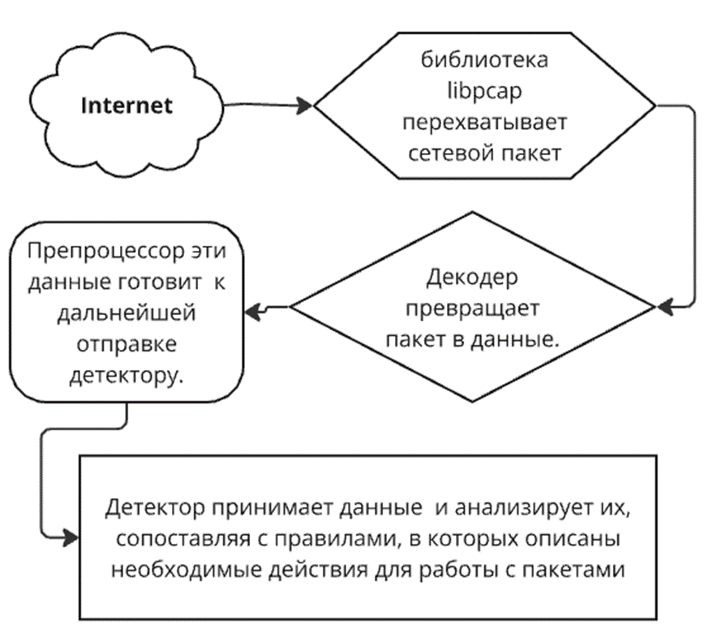

---
## Front matter
title: "Доклад"
subtitle: "Система обнаружения атак Snort"
author: "Латыпова Диана. НФИбд-02-21"

## Generic otions
lang: ru-RU
toc-title: "Содержание"

## Bibliography
bibliography: bib/cite.bib
csl: pandoc/csl/gost-r-7-0-5-2008-numeric.csl

## Pdf output format
toc: true # Table of contents
toc-depth: 2
lof: true # List of figures
lot: true # List of tables
fontsize: 12pt
linestretch: 1.5
papersize: a4
documentclass: scrreprt
## I18n polyglossia
polyglossia-lang:
  name: russian
  options:
	- spelling=modern
	- babelshorthands=true
polyglossia-otherlangs:
  name: english
## I18n babel
babel-lang: russian
babel-otherlangs: english
## Fonts
mainfont: IBM Plex Serif
romanfont: IBM Plex Serif
sansfont: IBM Plex Sans
monofont: IBM Plex Mono
mathfont: STIX Two Math
mainfontoptions: Ligatures=Common,Ligatures=TeX,Scale=0.94
romanfontoptions: Ligatures=Common,Ligatures=TeX,Scale=0.94
sansfontoptions: Ligatures=Common,Ligatures=TeX,Scale=MatchLowercase,Scale=0.94
monofontoptions: Scale=MatchLowercase,Scale=0.94,FakeStretch=0.9
mathfontoptions:
## Biblatex
biblatex: true
biblio-style: "gost-numeric"
biblatexoptions:
  - parentracker=true
  - backend=biber
  - hyperref=auto
  - language=auto
  - autolang=other*
  - citestyle=gost-numeric
## Pandoc-crossref LaTeX customization
figureTitle: "Рис."
tableTitle: "Таблица"
listingTitle: "Листинг"
lofTitle: "Список иллюстраций"
lotTitle: "Список таблиц"
lolTitle: "Листинги"
## Misc options
indent: true
header-includes:
  - \usepackage{indentfirst}
  - \usepackage{float} # keep figures where there are in the text
  - \floatplacement{figure}{H} # keep figures where there are in the text
---

# Цель работы

Изучение системы обнаружения вторжений Snort, её возможностей и принципов функционирования. Рассмотрение архитектуры Snort, принципы работы с правилами и сигнатурами атак, а также выявление преимуществ и недостатков использования данной системы.

# Теоретическая часть

## Введение

Информационная безопасность становится все более важной в условиях роста киберугроз и сетевых атак. Одним из ключевых инструментов защиты является система обнаружения вторжений (IDS — Intrusion Detection System). Snort — это одна из самых популярных и широко используемых систем IDS, которая применяется для анализа сетевого трафика и обнаружения подозрительных действий.

## Что такое Snort?

**Snort** — это открытая система обнаружения вторжений, разработанная для анализа сетевого трафика в режиме реального времени. Разработана компанией Sourcefire в 1998 году. Snort использует сигнатуры (правила) для выявления известных угроз, таких как вредоносные программы, попытки взлома, атаки отказа в обслуживании и другие аномалии [@wiki:bash].

Snort может функционировать в трех режимах:

- **Сниффер (Sniffer Mode).** В этом режиме Snort просто перехватывает и отображает сетевой трафик в реальном времени, что полезно для мониторинга и диагностики. Пример команды для запуска сниффера:
```
sudo snort -v
```

- **Регистратор пакетов (Packet Logger Mode).** В этом режиме Snort записывает весь трафик на жесткий диск для последующего анализа. Этот режим часто используется для хранения и последующего анализа огромных объемов сетевых данных. Пример команды для запуска в режиме регистрации пакетов:
```
sudo snort -dev -l /path/to/log
```

- **Система обнаружения вторжений  (IDS Mode).** Основной режим, в котором Snort анализирует трафик на предмет соответствия заранее заданным правилам и сигнатурам атак. Команда для запуска в режиме IDS:
```
sudo snort -c /etc/snort/snort.conf -i eth0
```
## Архитектура Snort

Основной задачей Snort является перехват и анализ каждого пакета данных, проходящего через сеть. 

Важные компоненты системы [@info:bash](рис. [-@fig:001]):

{#fig:001 width=70%}

- *Сниффер трафика:* Этот компонент перехватывает сетевые пакеты, которые проходят через сетевой интерфейс
- *Декодер пакетов:* анализирует структуру пакета (заголовки и данные)
- *Модуль предварительной обработки:* фильтрует и нормализует трафик, что помогает избежать обхода правил атаками
- *Детектор:* сравнивает пакеты с правилами и сигнатурами атак, выполняя обнаружение угроз
- *Модуль регистрации и уведомления:* сохраняет результаты анализа и уведомляет администратора о подозрительных событиях

## Правила и сигнатуры

Snort использует набор правил для обнаружения атак. Эти правила представляют собой заранее определенные сигнатуры угроз. Они описывают, какие пакеты считаются подозрительными, и задают действия, которые Snort должен выполнить при обнаружении таких пакетов (например, регистрировать инцидент или отправлять уведомление) [@it:bash].

Правила Snort могут определять:

- IP-адреса источника и назначения,
- используемые порты,
- протоколы,
- ключевые строки и шаблоны, содержащиеся в данных пакетов.

Каждое правило состоит из двух частей:

- **Заголовок:** указывает на характеристики пакета (протокол, адреса, порты).
- **Опции:** более детальная проверка содержимого пакета, включая поиск определенных строк и шаблонов.

Типы правил в Snort:

1. **Правила обнаружения.** Определяют и классифицируют подозрительные пакеты. Например, правила могут обнаруживать попытки внедрения SQL-инъекций или сканирование портов.
2. **Правила блокировки.** Используются в конфигурации Snort как системы предотвращения вторжений (IPS). Snort может быть настроен на активную блокировку пакетов при их соответствии определенным правилам.
3. **Правила уведомления.** Позволяют уведомлять администратора через разные каналы (например, отправка электронной почты) при срабатывании правила.

# Установка и настройка Snort

Процесс установки Snort зависит от операционной системы, однако основные этапы включают [@habr:bash]:

1. Установку программного обеспечения Snort.
2. Настройку конфигурационного файла snort.conf, где определяются параметры анализа трафика, путь к правилам, интерфейс сети и прочие настройки.
3. Загрузку или создание правил для обнаружения конкретных угроз.
4. Запуск Snort в одном из режимов — в частности, в режиме IDS для обнаружения угроз в реальном времени.

Пример команды для запуска Snort на Linux в режиме IDS:

```
sudo snort -c /etc/snort/snort.conf -i eth0
```

Здесь:

-c — указывает путь к файлу конфигурации,

-i — интерфейс, который будет мониторить Snort (например, eth0).

## Преимущества и недостатки Snort

|Преимущества| |Недостатки|
|-|-|-|
|ПО с открытым исходным кодом| |Высокая нагрузка на ресурсы|
|регулярное обновление базы правил для защиты от новых угроз| |Необходимость в регулярных обновлениях|
|Широкие возможности| |Чувствительность к обходу правил|
|Поддержка множества протоколов| |Ложные срабатывания|
|Интеграция с другими системами| ||

## Применение Snort

Snort широко используется как в коммерческих, так и в некоммерческих организациях. Он служит важным компонентом сетевой защиты для:

- Обнаружения вторжений: анализ сетевого трафика на наличие признаков атак.
- Сбора данных для последующего анализа: запись трафика и создание отчетов для выявления долгосрочных тенденций.
- Создания правил блокировки: при использовании в комбинации с брандмауэрами или другими защитными системами Snort может использоваться для блокировки подозрительных пакетов.

# Выводы

Snort является мощной и гибкой системой обнаружения вторжений, которая позволяет сетевым администраторам защитить свои системы от разнообразных угроз. Благодаря открытости и активной поддержке сообщества, Snort остается одним из лидеров среди IDS, обеспечивая надежную защиту сетей от современных кибератак.

# Список литературы{.unnumbered}

::: {#refs}
:::
