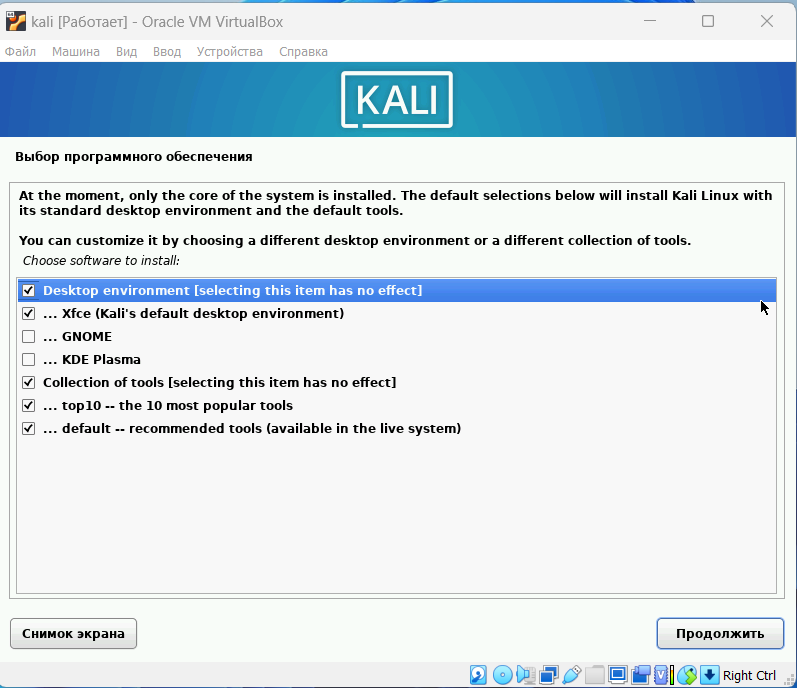
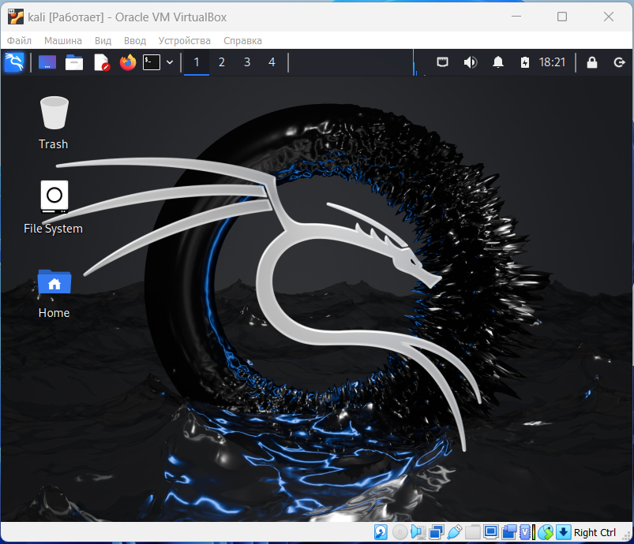

---
## Front matter
lang: ru-RU
title: Индивидуальный проект
subtitle: 1 этап
author:
  - Латыпова Диана
institute:
  - Российский университет дружбы народов имени Патриса Лумумбы, Москва, Россия
date: 01 января 1970

## i18n babel
babel-lang: russian
babel-otherlangs: english

## Formatting pdf
toc: false
toc-title: Содержание
slide_level: 2
aspectratio: 169
section-titles: true
theme: metropolis
header-includes:
 - \metroset{progressbar=frametitle,sectionpage=progressbar,numbering=fraction}
---

# Информация

## Докладчик

:::::::::::::: {.columns align=center}
::: {.column width="70%"}

  * Латыпова Диана
  * студент группы НФИбд-02-21
  * Российский университет дружбы народов имени Патриса Лумумбы
  * [1032215005@rudn.ru](mailto:1032215005@rudn.ru)
  * <https://github.com/dlatypova>

:::
::: {.column width="30%"}

:::
::::::::::::::

# Вводная часть

## Цели и задачи

- Ознакомление с дистрибутивом Kali Linux
- Установка дистрибутива Kali Linux в виртуальную машину.

# Теоретическое введение

## Основные характеристики Kali Linux

1. Предустановленные инструменты безопасности:

- *Nmap* — сканирование сетей.
- *Metasploit* — тестирование на проникновение.
- *Wireshark* — анализ сетевого трафика.
- *John the Ripper* — взлом паролей.
- *Aircrack-ng* — тестирование безопасности Wi-Fi сетей.

2. Linux поддерживает множество архитектур.
3. Многоязычная поддержка.
4. Модели работы:

- *Live USB*
- *Установка на жёсткий диск*
- *Работа в виртуальной машине*

5. Kali Linux сконфигурирован для безопасности по умолчанию.

## Основные задачи

Kali Linux используется для:

- Проведения тестов на проникновение (Penetration Testing).
- Анализа уязвимостей и аудита систем.
- Проведения цифровой криминалистики и восстановления данных.
- Обратной разработки и анализа вредоносного ПО.

# Выполнение лабораторной работы

## Создание ВМ

Скачивание образа Kali Linux с сайта: https://www.kali.org/

{#fig:002 width=50%}

## Начало установки Kali Linux

{#fig:003 width=50%}

Выбраны:

- Язык установки, страна;
- Язык для раскладки клавиатуры

## Создание учетной записи

- Имя пользователя:

{#fig:006 width=30%}

Пароль для пользователя:

{#fig:007 width=30%}

## Разметка диска

{#fig:008 width=40%}

## Выбор ПО

{#fig:009 width=40%}

## Успешная установка

{#fig:010 width=30%}

{#fig:011 width=40%}

# Выводы

## Выводы

- Ознакомилена с дистрибутивом Kali Linux
- Дистрибутив Kali Linux был успешно установлен в виртуальную машину.
