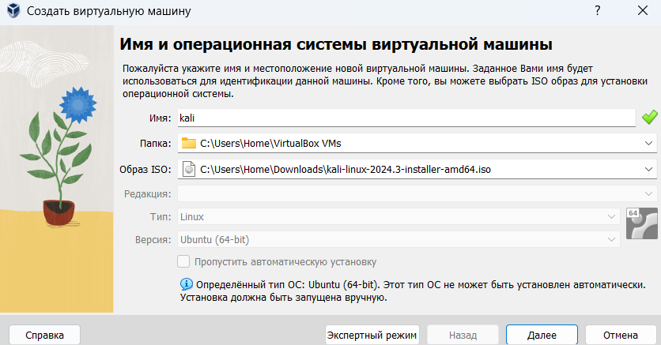
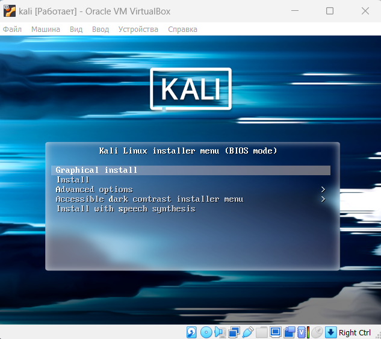
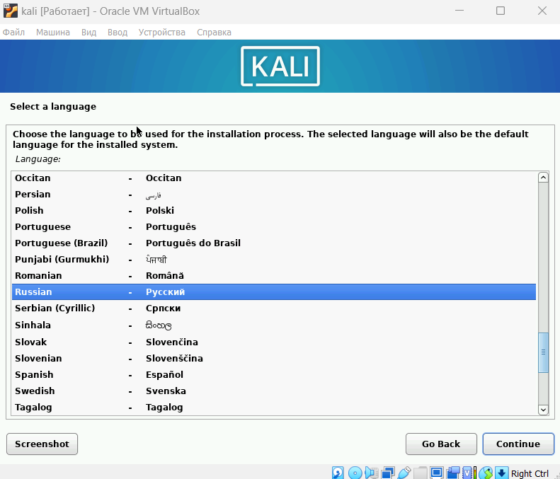
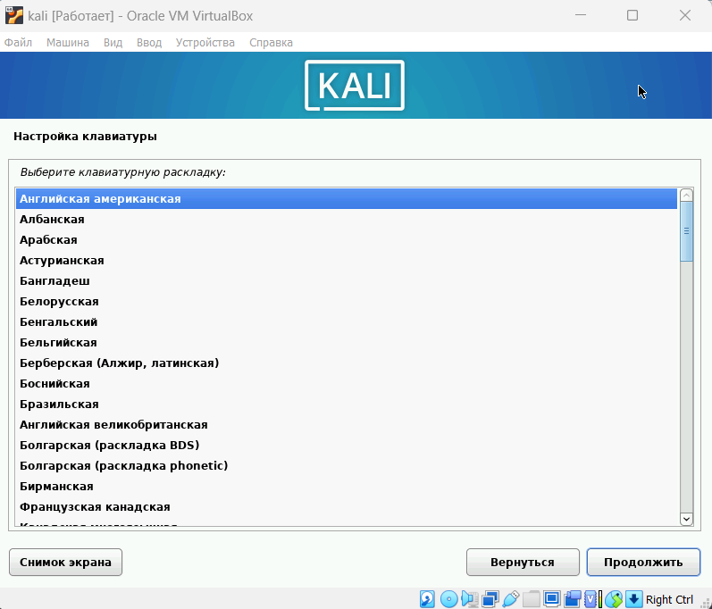
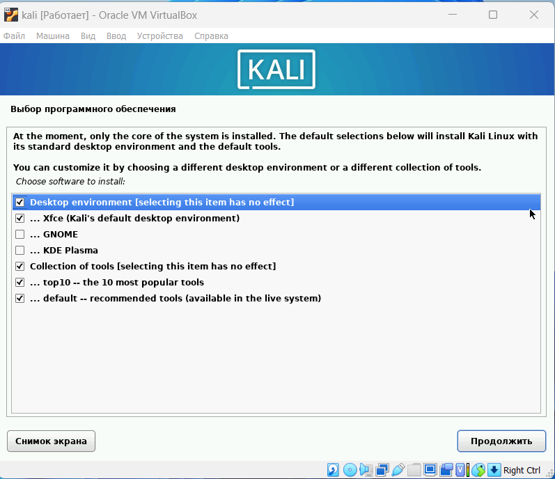
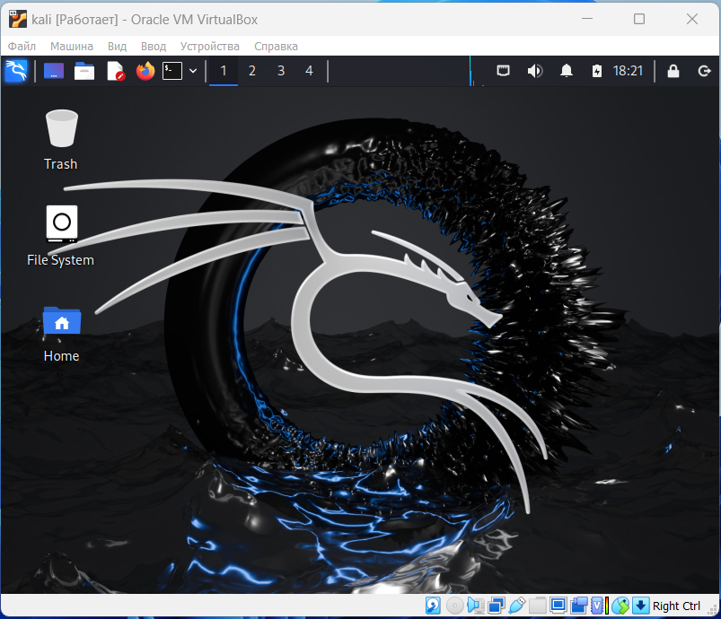

---
## Front matter
title: "Индивидуальный проект"
subtitle: "1 этап"
author: "Латыпова Диана. НФИбд-02-21"

## Generic otions
lang: ru-RU
toc-title: "Содержание"

## Bibliography
bibliography: bib/cite.bib
csl: pandoc/csl/gost-r-7-0-5-2008-numeric.csl

## Pdf output format
toc: true # Table of contents
toc-depth: 2
lof: true # List of figures
lot: true # List of tables
fontsize: 12pt
linestretch: 1.5
papersize: a4
documentclass: scrreprt
## I18n polyglossia
polyglossia-lang:
  name: russian
  options:
	- spelling=modern
	- babelshorthands=true
polyglossia-otherlangs:
  name: english
## I18n babel
babel-lang: russian
babel-otherlangs: english
## Fonts
mainfont: IBM Plex Serif
romanfont: IBM Plex Serif
sansfont: IBM Plex Sans
monofont: IBM Plex Mono
mathfont: STIX Two Math
mainfontoptions: Ligatures=Common,Ligatures=TeX,Scale=0.94
romanfontoptions: Ligatures=Common,Ligatures=TeX,Scale=0.94
sansfontoptions: Ligatures=Common,Ligatures=TeX,Scale=MatchLowercase,Scale=0.94
monofontoptions: Scale=MatchLowercase,Scale=0.94,FakeStretch=0.9
mathfontoptions:
## Biblatex
biblatex: true
biblio-style: "gost-numeric"
biblatexoptions:
  - parentracker=true
  - backend=biber
  - hyperref=auto
  - language=auto
  - autolang=other*
  - citestyle=gost-numeric
## Pandoc-crossref LaTeX customization
figureTitle: "Рис."
tableTitle: "Таблица"
listingTitle: "Листинг"
lofTitle: "Список иллюстраций"
lotTitle: "Список таблиц"
lolTitle: "Листинги"
## Misc options
indent: true
header-includes:
  - \usepackage{indentfirst}
  - \usepackage{float} # keep figures where there are in the text
  - \floatplacement{figure}{H} # keep figures where there are in the text
---

# Цель работы

Ознакомление с дистрибутивом Kali Linux.

# Задание

Установить дистрибутив Kali Linux в виртуальную машину.

# Теоретическое введение

**Kali Linux** [@kali:bash] — это дистрибутив операционной системы Linux, созданный для тестирования на проникновение (penetration testing), аудита безопасности и цифровой криминалистики. Он основан на Debian и поддерживает большое количество инструментов для анализа и обеспечения безопасности систем.

Основные характеристики Kali Linux:

1. Предустановленные инструменты безопасности:

- *Nmap* — сканирование сетей.
- *Metasploit* — тестирование на проникновение.
- *Wireshark* — анализ сетевого трафика.
- *John the Ripper* — взлом паролей.
- *Aircrack-ng* — тестирование безопасности Wi-Fi сетей.

2. Linux поддерживает множество архитектур, включая x86, x64, ARM (например, для Raspberry Pi), что позволяет использовать его на широком спектре устройств.
3. Многоязычная поддержка.
4. Модели работы:

- *Live USB*
- *Установка на жёсткий диск*
- *Работа в виртуальной машине*

5. Kali Linux сконфигурирован для безопасности по умолчанию.

Основные задачи:
Kali Linux используется преимущественно специалистами по кибербезопасности, этичными хакерами, исследователями и администраторами для:

- Проведения тестов на проникновение (Penetration Testing).
- Анализа уязвимостей и аудита систем.
- Проведения цифровой криминалистики и восстановления данных.
- Обратной разработки и анализа вредоносного ПО.
[@kali_linux_book]

# Выполнение лабораторной работы

Для начала скачала образ Kali Linux с сайта: https://www.kali.org/
 
Создала новую виртуальную машину (рис. [-@fig:001]):

{#fig:001 width=70%}

Задала для нее конфигурацию(рис. [-@fig:002]):

{#fig:002 width=70%}

Приступила к установке Kali Linux(рис. [-@fig:003]):

{#fig:003 width=70%}

Выбрала язык установки, страну (рис. [-@fig:004]):

{#fig:004 width=70%}

Язык для раскладки клавиатуры (рис. [-@fig:005]):

{#fig:005 width=70%}

Задала имя пользователя (рис. [-@fig:006]):

{#fig:006 width=70%}

Задала пароль для пользователя (рис. [-@fig:007]):

{#fig:007 width=70%}

Разметила диск (рис. [-@fig:008]):

{#fig:008 width=70%}

Выбрала ПО (рис. [-@fig:009]):

{#fig:009 width=70%}

После установки Kali Linux зашла в учетную запись (рис. [-@fig:010]):

{#fig:010 width=70%}

Видим успешную установку(рис. [-@fig:011]):

{#fig:011 width=70%}

# Выводы

Я ознакомилась с дистрибутивом Kali Linux. Дистрибутив Kali Linux был успешно установлен в виртуальную машину.

# Список литературы{.unnumbered}

::: {#refs}
:::
